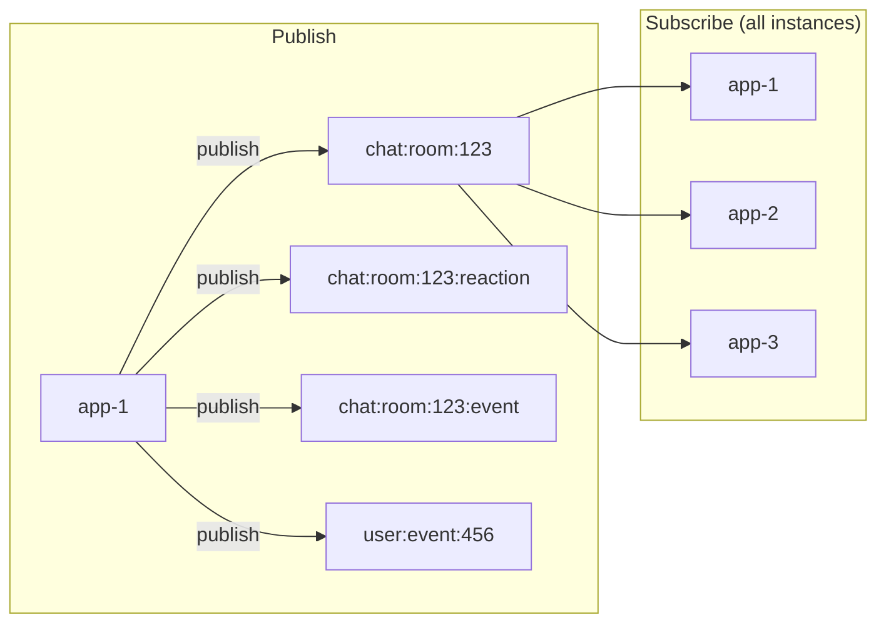
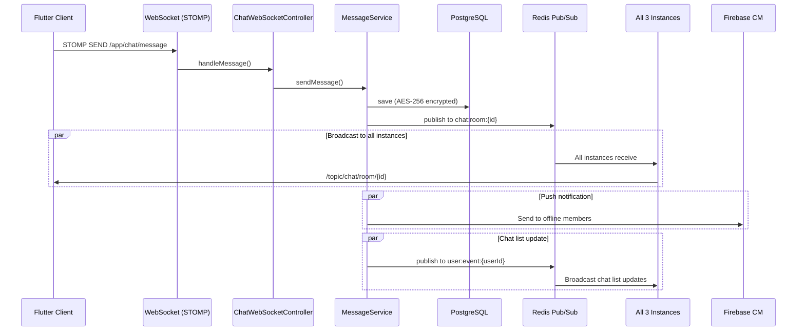
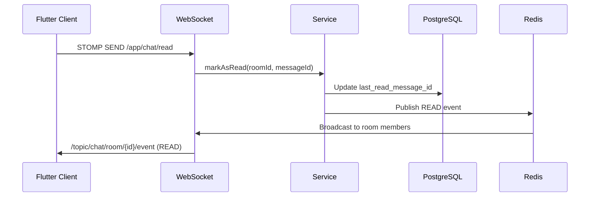

# API Design

[← Architecture Overview](./index)

---

## Table of Contents

- [Overview](#overview)
- [REST API Endpoints](#rest-api-endpoints)
- [WebSocket (STOMP)](#websocket-stomp)
- [Redis Pub/Sub Channels](#redis-pubsub-channels)
- [Message Flow](#message-flow)

---

## Overview

| Item | Detail |
|------|--------|
| **REST Base URL** | `/api/v1` |
| **Auth** | JWT Bearer Token (HMAC-SHA256) |
| **WebSocket** | STOMP over WebSocket at `/ws` |
| **Total REST Endpoints** | 68 |
| **Rate Limiting** | Nginx (L7) + Bucket4j/Redis (L4) |

### Error Response Format

```json
{
  "status": 400,
  "message": "Error message",
  "code": "ERROR_CODE"
}
```

---

## REST API Endpoints

### Auth (`/api/v1/auth`)

| Method | Endpoint | Description |
|--------|----------|-------------|
| POST | `/auth/signup` | Sign up |
| POST | `/auth/login` | Login (returns access + refresh token) |
| POST | `/auth/logout` | Logout (revoke refresh token) |
| POST | `/auth/refresh` | Refresh access token |
| GET | `/auth/me` | Current user info |
| PUT | `/auth/me` | Update profile |
| POST | `/auth/me/avatar` | Upload avatar |
| DELETE | `/auth/me` | Delete account |
| POST | `/auth/password/reset-request` | Request password reset email |
| POST | `/auth/password/reset` | Reset password with token |
| PUT | `/auth/password` | Change password (authenticated) |
| POST | `/auth/email/find` | Find email by nickname + phone |
| POST | `/auth/terms` | Agree to terms |

### User (`/api/v1/users`)

| Method | Endpoint | Description |
|--------|----------|-------------|
| GET | `/users/{id}` | Get user info |
| GET | `/users/search?q=keyword` | Search users |
| GET | `/users/{id}/profile` | Get user profile |
| GET | `/users/online-status` | Get online statuses |
| PUT | `/users/me/background` | Update background image |

### Friend (`/api/v1/friends`)

| Method | Endpoint | Description |
|--------|----------|-------------|
| GET | `/friends?userId={id}` | Friend list |
| POST | `/friends/requests` | Send friend request |
| GET | `/friends/requests/received?userId={id}` | Received requests |
| GET | `/friends/requests/sent?userId={id}` | Sent requests |
| POST | `/friends/requests/{id}/accept?userId={id}` | Accept request |
| POST | `/friends/requests/{id}/reject?userId={id}` | Reject request |
| DELETE | `/friends/{id}?userId={id}` | Remove friend |
| POST | `/friends/{id}/block` | Block user |
| DELETE | `/friends/{id}/block` | Unblock user |
| POST | `/friends/{id}/hide` | Hide friend |
| DELETE | `/friends/{id}/hide` | Unhide friend |

### Chat Room (`/api/v1/chat/rooms`)

| Method | Endpoint | Description |
|--------|----------|-------------|
| GET | `/chat/rooms` | Chat room list |
| POST | `/chat/rooms` | Create chat room |
| GET | `/chat/rooms/{id}` | Room details |
| PUT | `/chat/rooms/{id}` | Update room |
| DELETE | `/chat/rooms/{id}` | Leave room |
| GET | `/chat/rooms/{id}/members` | Room members |
| POST | `/chat/rooms/{id}/members` | Add members |
| DELETE | `/chat/rooms/{id}/members/{userId}` | Remove member |
| POST | `/chat/rooms/direct/{userId}` | Create/get direct chat |
| POST | `/chat/rooms/self` | Create/get self chat |
| PUT | `/chat/rooms/{id}/announcement` | Update announcement |
| PUT | `/chat/rooms/{id}/name` | Update room name |
| GET | `/chat/rooms/{id}/unread-count` | Unread count |

### Message (`/api/v1/chat/rooms/{roomId}/messages`)

| Method | Endpoint | Description |
|--------|----------|-------------|
| GET | `/chat/rooms/{roomId}/messages` | Message history (cursor pagination) |
| POST | `/chat/rooms/{roomId}/messages` | Send message (REST fallback) |
| GET | `/chat/rooms/{roomId}/messages/{id}` | Get message |
| PUT | `/chat/rooms/{roomId}/messages/{id}` | Edit message |
| DELETE | `/chat/rooms/{roomId}/messages/{id}` | Delete message (soft) |
| POST | `/chat/rooms/{roomId}/messages/{id}/reactions` | Add reaction |
| DELETE | `/chat/rooms/{roomId}/messages/{id}/reactions/{emoji}` | Remove reaction |
| POST | `/chat/rooms/{roomId}/messages/{id}/forward` | Forward message |
| GET | `/chat/rooms/{roomId}/messages/search?q=query` | Search messages |
| POST | `/chat/rooms/{roomId}/read` | Mark as read |
| GET | `/chat/rooms/{roomId}/messages/since?messageId={id}` | Gap recovery |
| GET | `/chat/rooms/{roomId}/messages/around/{id}` | Messages around ID |

### Notification (`/api/v1/notifications`)

| Method | Endpoint | Description |
|--------|----------|-------------|
| GET | `/notifications/settings` | Get notification settings |
| PUT | `/notifications/settings` | Update notification settings |
| POST | `/notifications/device-token` | Register device token |
| DELETE | `/notifications/device-token` | Unregister device token |

### File (`/api/v1/files`)

| Method | Endpoint | Description |
|--------|----------|-------------|
| POST | `/files/upload` | Upload file (multipart) |

### Admin (`/api/v1/admin`)

| Method | Endpoint | Description |
|--------|----------|-------------|
| GET | `/admin/reports` | List reports |
| GET | `/admin/reports/{id}` | Report details |
| PUT | `/admin/reports/{id}` | Process report |
| GET | `/admin/users` | List users |
| GET | `/admin/users/{id}` | User details |
| PUT | `/admin/users/{id}/status` | Update user status |
| GET | `/admin/statistics` | Platform statistics |
| GET | `/admin/statistics/messages` | Message statistics |
| GET | `/admin/statistics/users` | User statistics |
| GET | `/admin/statistics/chat-rooms` | Chat room statistics |

---

## WebSocket (STOMP)

### Connection

| Item | Detail |
|------|--------|
| **Endpoint** | `ws://{host}/ws` (SockJS fallback) |
| **Protocol** | STOMP 1.2 |
| **Auth** | JWT token in STOMP CONNECT headers |
| **Message Size** | 128KB max |

### Client → Server (SEND)

| Destination | Payload | Description |
|-------------|---------|-------------|
| `/app/chat/message` | `{roomId, content, type, ...}` | Send message |
| `/app/chat/typing` | `{roomId, userId}` | Typing start |
| `/app/chat/typing/stop` | `{roomId, userId}` | Typing stop |
| `/app/chat/read` | `{roomId, userId, messageId}` | Mark as read |
| `/app/chat/reaction` | `{roomId, messageId, emoji, action}` | Add/remove reaction |

### Server → Client (SUBSCRIBE)

| Topic | Events | Description |
|-------|--------|-------------|
| `/topic/chat/room/{roomId}` | MESSAGE, LINK_PREVIEW_UPDATED | New messages |
| `/topic/chat/room/{roomId}/reaction` | REACTION_ADDED, REACTION_REMOVED | Reactions |
| `/topic/chat/room/{roomId}/event` | TYPING, STOP_TYPING, READ, MESSAGE_DELETED, MESSAGE_UPDATED, USER_LEFT, USER_JOINED | Room events |
| `/topic/user/{userId}` | Chat list updates, online status | Per-user events |

### Event Payload

All WebSocket events include:

```json
{
  "eventId": "unique-event-id",
  "schemaVersion": 1,
  "type": "MESSAGE",
  "data": { ... },
  "timestamp": "2026-02-19T12:00:00"
}
```

- `eventId`: Unique identifier for client-side deduplication
- `schemaVersion`: Protocol version for forward compatibility

---

## Redis Pub/Sub Channels



| Channel | Purpose |
|---------|---------|
| `chat:room:{roomId}` | Chat messages (TEXT, IMAGE, FILE, SYSTEM) |
| `chat:room:{roomId}:reaction` | Reaction events |
| `chat:room:{roomId}:event` | Room events (READ, TYPING, DELETE, UPDATE, USER_LEFT, USER_JOINED) |
| `user:event:{userId}` | User-specific events (chat list updates, profile updates) |

---

## Message Flow

### Send Message (Happy Path)



### Read Receipt Flow



---

## Related Documents

→ [API Reference (detailed)](../api/index)
→ [Backend Architecture](./backend)
→ [Frontend Architecture](./frontend)
