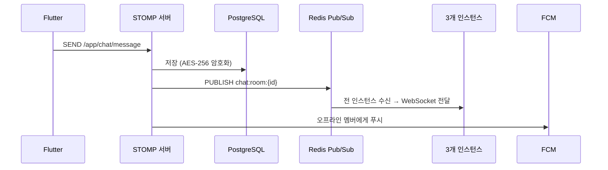

# API 설계

[← 아키텍처 개요](./index)

---

## 요약

| 항목 | 내용 |
|------|------|
| **REST Base URL** | `/api/v1` |
| **인증** | JWT Bearer Token (HMAC-SHA256) |
| **WebSocket** | STOMP at `/ws` (SockJS fallback) |
| **총 엔드포인트** | 68개 |
| **API 문서** | [상세 API Reference](../api/) |

---

## REST API 엔드포인트

### 인증 (`/api/v1/auth`)

| Method | 경로 | 설명 |
|--------|------|------|
| POST | `/auth/signup` | 회원가입 |
| POST | `/auth/login` | 로그인 |
| POST | `/auth/logout` | 로그아웃 |
| POST | `/auth/refresh` | 토큰 갱신 |
| GET | `/auth/me` | 내 정보 |
| PUT | `/auth/me` | 프로필 수정 |
| DELETE | `/auth/me` | 계정 삭제 |

### 사용자 (`/api/v1/users`)

| Method | 경로 | 설명 |
|--------|------|------|
| GET | `/users/{id}` | 사용자 조회 |
| GET | `/users/search?q=` | 사용자 검색 |
| GET | `/users/{id}/profile` | 프로필 조회 |

### 친구 (`/api/v1/friends`)

| Method | 경로 | 설명 |
|--------|------|------|
| GET | `/friends` | 친구 목록 |
| POST | `/friends/requests` | 친구 요청 |
| POST | `/friends/requests/{id}/accept` | 수락 |
| POST | `/friends/requests/{id}/reject` | 거절 |
| DELETE | `/friends/{id}` | 친구 삭제 |
| POST | `/friends/{id}/block` | 차단 |
| POST | `/friends/{id}/hide` | 숨김 |

### 채팅방 (`/api/v1/chat/rooms`)

| Method | 경로 | 설명 |
|--------|------|------|
| GET | `/chat/rooms` | 채팅방 목록 |
| POST | `/chat/rooms` | 채팅방 생성 |
| GET | `/chat/rooms/{id}` | 상세 조회 |
| POST | `/chat/rooms/direct/{userId}` | 1:1 채팅 생성/조회 |
| POST | `/chat/rooms/self` | 셀프 채팅 |
| DELETE | `/chat/rooms/{id}` | 나가기 |
| POST | `/chat/rooms/{id}/read` | 읽음 처리 |

### 메시지 (`/api/v1/chat/rooms/{roomId}/messages`)

| Method | 경로 | 설명 |
|--------|------|------|
| GET | `.../messages` | 히스토리 (커서 페이지네이션) |
| POST | `.../messages` | 메시지 전송 (REST 폴백) |
| PUT | `.../messages/{id}` | 수정 |
| DELETE | `.../messages/{id}` | 삭제 (soft) |
| POST | `.../messages/{id}/reactions` | 리액션 추가 |
| POST | `.../messages/{id}/forward` | 전달 |
| GET | `.../messages/since?messageId=` | Gap Recovery |

### 기타

| 컨트롤러 | 주요 엔드포인트 |
|----------|----------------|
| **Notification** | 알림 설정 조회/수정, 디바이스 토큰 등록/해제 |
| **File** | 파일 업로드 (multipart) |
| **Admin** | 신고 관리, 사용자 관리, 통계 |

> 전체 68개 엔드포인트의 상세 스펙은 [API Reference](../api/) 참조

---

## WebSocket (STOMP)

### 클라이언트 → 서버

| Destination | 설명 |
|-------------|------|
| `/app/chat/message` | 메시지 전송 |
| `/app/chat/typing` | 타이핑 시작 |
| `/app/chat/typing/stop` | 타이핑 중지 |
| `/app/chat/read` | 읽음 확인 |
| `/app/chat/reaction` | 리액션 추가/제거 |

### 서버 → 클라이언트

| Topic | 이벤트 |
|-------|--------|
| `/topic/chat/room/{roomId}` | MESSAGE, LINK_PREVIEW_UPDATED |
| `/topic/chat/room/{roomId}/reaction` | REACTION_ADDED/REMOVED |
| `/topic/chat/room/{roomId}/event` | TYPING, READ, DELETE, UPDATE, USER_LEFT/JOINED |
| `/topic/user/{userId}` | 채팅 목록 업데이트, 온라인 상태 |

### 메시지 페이로드

```json
{
  "eventId": "고유 ID (중복 제거용)",
  "schemaVersion": 1,
  "type": "MESSAGE",
  "data": { ... }
}
```

---

## 메시지 전송 흐름



---

## 관련 문서

→ [API Reference (상세)](../api/)
→ [백엔드 아키텍처](./backend)
