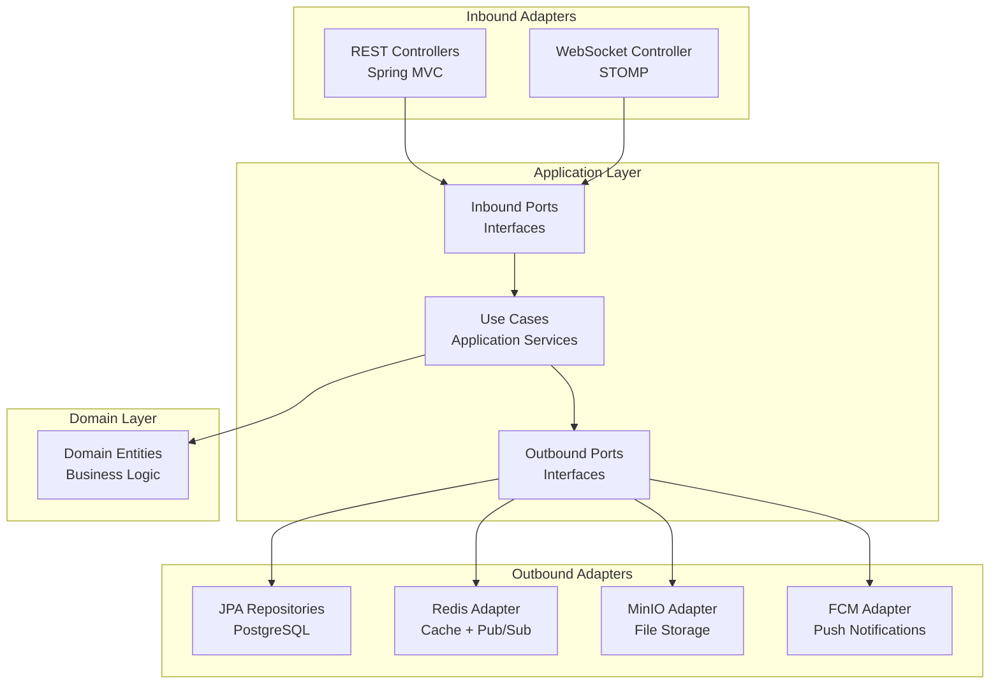
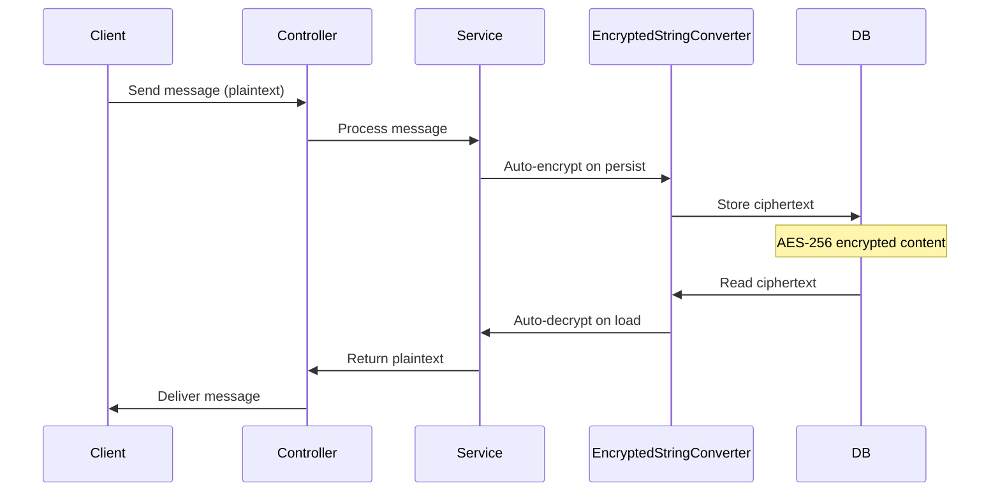
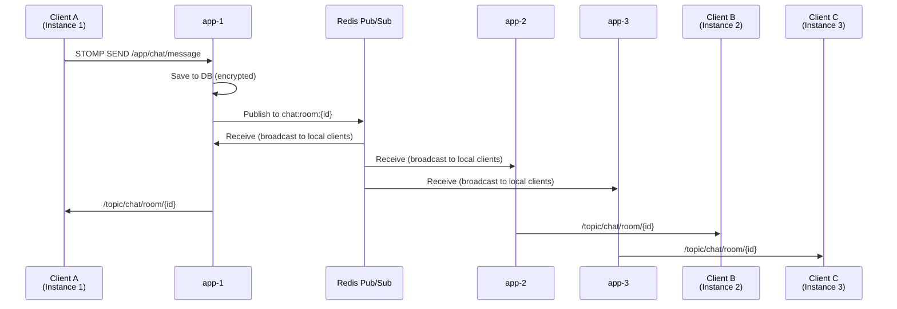

# Backend Architecture

[← Architecture Overview](./index)

---

## Table of Contents

- [Overview](#overview)
- [Hexagonal Architecture](#hexagonal-architecture)
- [Package Structure](#package-structure)
- [Design Patterns](#design-patterns)
- [WebSocket & Real-Time](#websocket--real-time)
- [Security](#security)
- [Key Components](#key-components)

---

## Overview

| Item | Detail |
|------|--------|
| **Language** | Java 25 (Virtual Threads, JEP 491) |
| **Framework** | Spring Boot 3.5.6 (Spring MVC) |
| **Architecture** | Hexagonal (Ports & Adapters) |
| **Database** | PostgreSQL 16 + Spring Data JPA + QueryDSL 5.1.0 |
| **Cache** | Redis 7 (RedisCacheManager) |
| **Real-Time** | STOMP over WebSocket + Redis Pub/Sub |
| **File Storage** | MinIO (S3-compatible) |
| **ID Strategy** | Snowflake ID (application-generated) |
| **Encryption** | AES-256 (message content at rest) |
| **Migration** | Flyway (SQL-based) |

---

## Hexagonal Architecture



**Dependency Direction**: Adapters → Application → Domain (domain has zero outward dependencies)

### Layer Responsibilities

| Layer | Responsibility |
|-------|---------------|
| **Domain** | Pure entities, value objects, business rules. No framework dependencies. |
| **Application** | Use cases (service orchestration), inbound/outbound port interfaces, DTOs. |
| **Adapter (Inbound)** | REST controllers, WebSocket controller, request/response mapping. |
| **Adapter (Outbound)** | JPA repositories, Redis operations, MinIO file ops, FCM push. |

---

## Package Structure

```
com.cotalk/
├── adapter/
│   ├── inbound/
│   │   ├── rest/           # REST controllers (8 controllers)
│   │   │   ├── AuthController
│   │   │   ├── UserController
│   │   │   ├── FriendController
│   │   │   ├── ChatRoomController
│   │   │   ├── MessageController
│   │   │   ├── NotificationController
│   │   │   ├── FileController
│   │   │   └── AdminController
│   │   └── websocket/      # STOMP WebSocket
│   │       └── ChatWebSocketController
│   └── outbound/
│       ├── persistence/    # JPA repositories, entities, mappers
│       ├── redis/          # Redis cache, Pub/Sub
│       ├── storage/        # MinIO file operations
│       └── fcm/            # Firebase Cloud Messaging
├── application/
│   ├── port/
│   │   ├── inbound/        # Use case interfaces
│   │   └── outbound/       # Repository port interfaces
│   ├── service/            # Application services (use case impl)
│   └── dto/                # Request/Response DTOs (records)
├── domain/
│   ├── entity/             # Domain entities (JPA)
│   ├── enums/              # Status enums, types
│   └── exception/          # Domain exceptions
└── config/                 # Spring configurations
    ├── SecurityConfig
    ├── WebSocketConfig
    ├── CacheConfig
    ├── RedisConfig
    └── RateLimitConfig
```

---

## Design Patterns

### Snowflake ID Generation

All primary entities use application-generated Snowflake IDs (BIGINT) for globally unique, time-ordered identifiers. Exceptions: `message_reactions`, `password_reset_tokens`, `terms_agreements`, `profile_history`, `hidden_friends` use `GenerationType.IDENTITY`.

### AES-256 Message Encryption



- `EncryptedStringConverter` (JPA `@Converter`): Transparent AES-256 encryption/decryption
- `ENCRYPTION_KEY` from environment variable

### CQRS-Lite with QueryDSL

- **Commands**: Spring Data JPA repositories for writes
- **Queries**: QueryDSL 5.1.0 (Jakarta) for complex, type-safe dynamic queries
- Applied to: message search, friend list with filters, chat room queries

### Virtual Threads (JEP 491)

```yaml
spring:
  threads:
    virtual:
      enabled: true
```

- Spring MVC request handling on virtual threads (no WebFlux needed)
- JEP 491 resolves pinning issue in `synchronized` blocks
- Carrier thread released during I/O blocking operations

---

## WebSocket & Real-Time

### STOMP Protocol

| Item | Detail |
|------|--------|
| **Endpoint** | `/ws` (SockJS fallback) |
| **Protocol** | STOMP over WebSocket |
| **Broker** | SimpleBroker (local) + Redis Pub/Sub (multi-instance) |
| **Auth** | JWT validation on STOMP CONNECT |
| **Authorization** | Chat room membership check on SUBSCRIBE |

### Multi-Instance Message Flow



### Redis Channel Structure

| Channel Pattern | Purpose |
|-----------------|---------|
| `chat:room:{roomId}` | Chat messages |
| `chat:room:{roomId}:reaction` | Reaction events |
| `chat:room:{roomId}:event` | Room events (READ, TYPING, DELETE, UPDATE) |
| `user:event:{userId}` | User events (chat list updates) |

### Key Components

| Component | Role |
|-----------|------|
| `ChatWebSocketController` | STOMP message handling, individual try-catch per broadcast |
| `RedisChatMessageBroker` | Publish messages to Redis channels |
| `RedisChatMessageSubscriber` | Subscribe to Redis, forward to local WebSocket clients |
| `WebSocketEventListener` | Connection/disconnect events, online status tracking |

### Event Types

MESSAGE, REACTION_ADDED, REACTION_REMOVED, TYPING, STOP_TYPING, READ, MESSAGE_DELETED, MESSAGE_UPDATED, LINK_PREVIEW_UPDATED, USER_LEFT, USER_JOINED

### Transport Limits

| Setting | Value |
|---------|-------|
| Message size | 128KB |
| Send buffer | 1MB |
| Send timeout | 20 seconds |

### Schema Versioning

All WebSocket messages include `schemaVersion` + `eventId` fields for client-side deduplication support.

---

## Security

### Authentication & Authorization

| Feature | Implementation |
|---------|---------------|
| **JWT** | HMAC-SHA256, Access + Refresh Token |
| **Password** | BCrypt hashing |
| **Session** | Stateless (Spring Security) |
| **Role-Based** | USER / ADMIN roles |

### Data Protection

| Feature | Implementation |
|---------|---------------|
| **Message Encryption** | AES-256 at rest (`EncryptedStringConverter`) |
| **Secrets** | Environment variables (DB_PASSWORD, JWT_SECRET, ENCRYPTION_KEY, MINIO_ACCESS_KEY, MINIO_SECRET_KEY) |
| **Actuator** | Sensitive endpoints (env, loggers) removed |

### Rate Limiting (Bucket4j + Redis)

| Endpoint | Limit |
|----------|-------|
| Login | 5/min |
| Signup | 3/min |
| File upload | 10/min + 50/hr |

Rate limit state stored in Redis for consistency across 3 instances.

---

## Key Components

### Caching (RedisCacheManager)

| Cache | TTL |
|-------|-----|
| USER | 1 hour |
| CHAT_ROOM | 30 min |
| STATISTICS | 5 min |

Redis-backed cache ensures consistency across all 3 application instances.

### File Upload (MinIO)

- S3-compatible object storage (AWS SDK S3 2.25.16)
- HEIC/HEIF + video MIME types supported
- Thumbnail generation for images
- Nginx proxies `/files/` → MinIO (MinIO port not exposed externally)

### Push Notifications (FCM)

- Firebase Admin SDK 9.2.0
- Device token management per user
- Firebase App Check for client verification

### Link Preview

- jsoup 1.17.2 for HTML parsing
- Async link preview extraction on message send
- Preview data stored on message entity (url, title, description, image)

### Observability

| Tool | Purpose |
|------|---------|
| **Micrometer + Prometheus** | Custom metrics: messages, logins, WebSocket connections, Redis pub/delivery |
| **Micrometer Tracing (Brave)** | Distributed tracing → Zipkin |
| **Logstash Logback Encoder** | Structured JSON logging → Loki |

---

## Next

→ [Frontend Architecture](./frontend)
