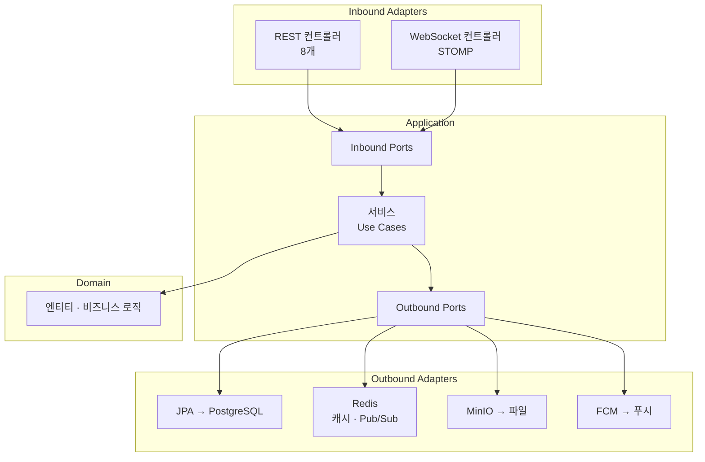
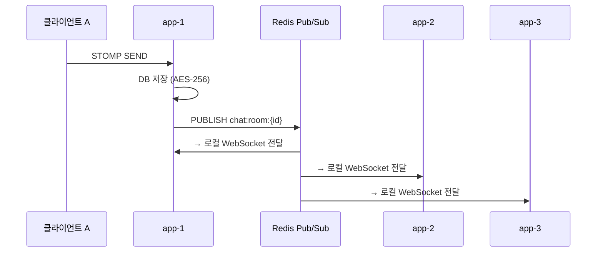

# 백엔드 아키텍처

[← 아키텍처 개요](./index)

---

## 요약

| 항목 | 내용 |
|------|------|
| **언어** | Java 25 (Virtual Threads, JEP 491) |
| **프레임워크** | Spring Boot 3.5.6 (Spring MVC) |
| **아키텍처** | Hexagonal (Ports & Adapters) |
| **DB** | PostgreSQL 16 + JPA + QueryDSL 5.1.0 |
| **캐시** | Redis 7 (RedisCacheManager) |
| **실시간** | STOMP over WebSocket + Redis Pub/Sub |
| **파일** | MinIO (S3 호환) |
| **ID** | Snowflake ID (애플리케이션 생성) |
| **암호화** | AES-256 (메시지 내용) |
| **마이그레이션** | Flyway (SQL) |

---

## 헥사고날 아키텍처



**의존성 방향**: Adapter → Application → Domain (도메인은 외부 의존 없음)

---

## 패키지 구조

```
com.cotalk/
├── adapter/inbound/
│   ├── rest/              # 8개 REST 컨트롤러 + DTO (record)
│   └── websocket/         # STOMP WebSocket 컨트롤러
├── adapter/outbound/
│   ├── persistence/       # JPA 리포지토리
│   ├── redis/             # Redis 캐시, Pub/Sub
│   ├── storage/           # MinIO 파일
│   └── fcm/               # Firebase 푸시
├── application/
│   ├── port/inbound/      # Use Case 인터페이스
│   ├── port/outbound/     # Repository 인터페이스
│   ├── service/           # Use Case 구현체
│   └── dto/               # Request/Response
├── domain/
│   ├── entity/            # JPA 엔티티
│   ├── enums/             # 상태 Enum
│   └── exception/         # 도메인 예외
└── config/                # Security, WebSocket, Cache, Redis, RateLimit
```

---

## 핵심 설계 패턴

| 패턴 | 설명 |
|------|------|
| **AES-256 투명 암호화** | JPA `@Converter`로 메시지 저장 시 자동 암호화/조회 시 복호화 |
| **Snowflake ID** | 3개 인스턴스에서 충돌 없는 분산 ID 생성 (BIGINT) |
| **CQRS-lite** | 명령/조회 Use Case 인터페이스 분리 |
| **스키마 버전관리** | WebSocket 메시지에 `schemaVersion` + `eventId` 포함 |

---

## 실시간 메시징

### 멀티 인스턴스 메시지 흐름



### Redis 채널 구조

| 채널 | 용도 |
|------|------|
| `chat:room:{roomId}` | 채팅 메시지 |
| `chat:room:{roomId}:reaction` | 리액션 이벤트 |
| `chat:room:{roomId}:event` | READ, TYPING, DELETE, UPDATE 등 |
| `user:event:{userId}` | 채팅 목록 업데이트 |

### 이벤트 타입

MESSAGE · REACTION_ADDED · REACTION_REMOVED · TYPING · STOP_TYPING · READ · MESSAGE_DELETED · MESSAGE_UPDATED · LINK_PREVIEW_UPDATED · USER_LEFT · USER_JOINED

---

## 보안

| 항목 | 구현 |
|------|------|
| **인증** | JWT (HMAC-SHA256), Access + Refresh Token |
| **비밀번호** | BCrypt |
| **메시지 암호화** | AES-256 at rest |
| **Rate Limiting** | Bucket4j + Redis (인스턴스 간 공유) |
| **Actuator** | 민감 엔드포인트 제거 |

### Rate Limit

| 엔드포인트 | 제한 |
|------------|------|
| 로그인 | 5회/분 |
| 회원가입 | 3회/분 |
| 파일 업로드 | 10회/분 + 50회/시간 |

---

## 캐시 (Redis)

| 캐시 | TTL |
|------|-----|
| USER | 1시간 |
| CHAT_ROOM | 30분 |
| STATISTICS | 5분 |

---

## 관측성

| 도구 | 용도 |
|------|------|
| Micrometer + Prometheus | 커스텀 메트릭 (메시지, 로그인, WebSocket, Redis) |
| Micrometer Tracing (Brave) | 분산 추적 → Zipkin |
| Logstash Logback Encoder | 구조화 JSON 로깅 → Loki |

---

→ [프론트엔드 아키텍처](./frontend)
