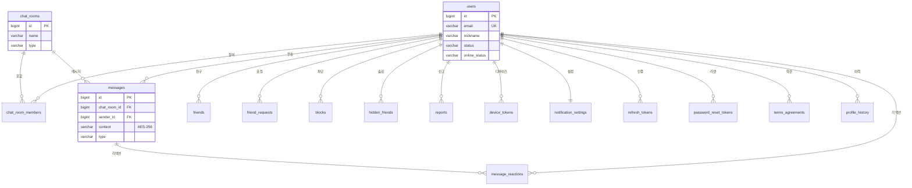

# 데이터베이스 설계

[← 아키텍처 개요](./index)

---

## 요약

| 항목 | 내용 |
|------|------|
| **DB** | PostgreSQL 16 (Alpine, 512MB) |
| **ORM** | Spring Data JPA + QueryDSL 5.1.0 |
| **마이그레이션** | Flyway (V1: 스키마, V2: 인덱스) |
| **ID 전략** | Snowflake ID (BIGINT) |
| **암호화** | messages.content → AES-256 |
| **테이블 수** | 16개 |

---

## ER 다이어그램

---

## 테이블 목록 (16개)

### 핵심 테이블

| # | 테이블 | PK 전략 | 주요 컬럼 | 설명 |
|---|--------|---------|-----------|------|
| 1 | **users** | Snowflake | email(UK), nickname, status, role, online_status, status_message | 사용자 |
| 2 | **chat_rooms** | Snowflake | name, type(DIRECT/GROUP/SELF), announcement | 채팅방 |
| 3 | **chat_room_members** | Snowflake | chat_room_id(FK), user_id(FK), role, last_read_message_id | 채팅방 멤버 |
| 4 | **messages** | Snowflake | chat_room_id(FK), sender_id(FK), content(AES-256), type, file_*, link_preview_*, reply_to, forwarded_from | 메시지 |
| 5 | **message_reactions** | IDENTITY | message_id(FK), user_id(FK), emoji | 리액션 |

### 친구/차단

| # | 테이블 | PK 전략 | UK 제약 | 설명 |
|---|--------|---------|---------|------|
| 6 | **friends** | Snowflake | (user_id, friend_id) | 친구 관계 |
| 7 | **friend_requests** | Snowflake | (requester_id, receiver_id) | 친구 요청 |
| 8 | **blocks** | Snowflake | (blocker_id, blocked_id) | 차단 |
| 9 | **hidden_friends** | IDENTITY | (user_id, friend_id) | 숨김 |

### 시스템

| # | 테이블 | PK 전략 | 설명 |
|---|--------|---------|------|
| 10 | **reports** | Snowflake | 신고 (사용자/메시지/채팅방) |
| 11 | **device_tokens** | Snowflake | FCM 디바이스 토큰 |
| 12 | **notification_settings** | Snowflake | 알림 설정 (1:1 with users) |
| 13 | **refresh_tokens** | Snowflake | JWT Refresh Token |
| 14 | **password_reset_tokens** | IDENTITY | 비밀번호 리셋 토큰 |
| 15 | **terms_agreements** | IDENTITY | 약관 동의 |
| 16 | **profile_history** | IDENTITY | 프로필 변경 이력 |

---

## 주요 인덱스

| 테이블 | 인덱스 | 용도 |
|--------|--------|------|
| messages | (chat_room_id, created_at DESC) | 메시지 히스토리 조회 |
| messages | GIN(to_tsvector(content)) | 전문 검색 |
| chat_room_members | (chat_room_id, user_id) | 멤버십 확인 |
| friends | (user_id), (friend_id), (status) | 친구 목록 |
| friend_requests | (requester_id), (receiver_id), (status) | 요청 목록 |
| reports | (status), (created_at DESC) | 관리자 조회 |

---

→ [API 설계](./api)
