# Database Design

[← Architecture Overview](./index)

---

## Table of Contents

- [Overview](#overview)
- [Tables (16)](#tables-16)
- [ER Diagram](#er-diagram)
- [Indexes](#indexes)
- [Migration Strategy](#migration-strategy)

---

## Overview

| Item | Detail |
|------|--------|
| **Database** | PostgreSQL 16 (Alpine) |
| **ORM** | Spring Data JPA + QueryDSL 5.1.0 |
| **Migration** | Flyway (SQL-based, V1 + V2) |
| **ID Strategy** | Snowflake ID (BIGINT, application-generated) |
| **Encryption** | AES-256 on message `content` column |
| **Memory** | 512MB (production) |
| **Tables** | 16 |

**ID Exception**: `message_reactions`, `password_reset_tokens`, `terms_agreements`, `profile_history`, `hidden_friends` use `GENERATED BY DEFAULT AS IDENTITY`.

---

## Tables (16)

### 1. users

Primary user table. All other tables reference this.

| Column | Type | Description |
|--------|------|-------------|
| id | BIGINT PK | Snowflake ID |
| email | VARCHAR(255) UNIQUE | Email address |
| password_hash | VARCHAR(255) | BCrypt hash |
| nickname | VARCHAR(255) | Display name |
| avatar_url | VARCHAR(255) | Profile image URL |
| oauth_provider | VARCHAR(255) | OAuth provider (nullable) |
| oauth_id | VARCHAR(255) | OAuth ID (nullable) |
| status | VARCHAR(255) | ACTIVE / SUSPENDED / DELETED |
| role | VARCHAR(255) | USER / ADMIN |
| online_status | VARCHAR(255) | ONLINE / OFFLINE / AWAY |
| last_active_at | TIMESTAMP | Last activity time |
| status_message | VARCHAR(60) | Status message |
| background_url | VARCHAR(500) | Profile background image |
| created_at | TIMESTAMP | |
| updated_at | TIMESTAMP | |

### 2. chat_rooms

| Column | Type | Description |
|--------|------|-------------|
| id | BIGINT PK | Snowflake ID |
| name | VARCHAR(255) | Room name (nullable for DM) |
| announcement | VARCHAR(500) | Room announcement |
| type | VARCHAR(255) | DIRECT / GROUP / SELF |
| created_at | TIMESTAMP | |
| updated_at | TIMESTAMP | |

### 3. chat_room_members

| Column | Type | Description |
|--------|------|-------------|
| id | BIGINT PK | Snowflake ID |
| chat_room_id | BIGINT FK | → chat_rooms |
| user_id | BIGINT FK | → users |
| role | VARCHAR(255) | MEMBER / ADMIN / OWNER |
| last_read_at | TIMESTAMP | Last read time |
| last_read_message_id | BIGINT | Last read message |
| joined_at | TIMESTAMP | |
| updated_at | TIMESTAMP | |

**Constraint**: UNIQUE(chat_room_id, user_id)

### 4. messages

| Column | Type | Description |
|--------|------|-------------|
| id | BIGINT PK | Snowflake ID |
| chat_room_id | BIGINT FK | → chat_rooms |
| sender_id | BIGINT FK | → users |
| content | VARCHAR(4000) | AES-256 encrypted |
| type | VARCHAR(255) | TEXT / IMAGE / FILE / SYSTEM |
| file_url | VARCHAR(255) | Uploaded file URL |
| file_name | VARCHAR(255) | Original filename |
| file_size | BIGINT | File size in bytes |
| file_content_type | VARCHAR(255) | MIME type |
| thumbnail_url | VARCHAR(255) | Image thumbnail |
| reply_to_message_id | BIGINT | Reply reference |
| forwarded_from_message_id | BIGINT | Forward reference |
| link_preview_url | VARCHAR(2048) | Link preview URL |
| link_preview_title | VARCHAR(512) | Link preview title |
| link_preview_description | VARCHAR(1000) | Link preview description |
| link_preview_image_url | VARCHAR(2048) | Link preview image |
| deleted_at | TIMESTAMP | Soft delete time |
| is_deleted | BOOLEAN | Soft delete flag |
| created_at | TIMESTAMP | |
| updated_at | TIMESTAMP | |

### 5. message_reactions (IDENTITY)

| Column | Type | Description |
|--------|------|-------------|
| id | BIGINT IDENTITY PK | Auto-generated |
| message_id | BIGINT FK | → messages |
| user_id | BIGINT FK | → users |
| emoji | VARCHAR(50) | Emoji character |
| created_at | TIMESTAMP | |
| updated_at | TIMESTAMP | |

**Constraint**: UNIQUE(message_id, user_id, emoji)

### 6. friends

| Column | Type | Description |
|--------|------|-------------|
| id | BIGINT PK | Snowflake ID |
| user_id | BIGINT FK | → users |
| friend_id | BIGINT FK | → users |
| status | VARCHAR(255) | ACCEPTED |
| created_at | TIMESTAMP | |
| updated_at | TIMESTAMP | |

**Constraint**: UNIQUE(user_id, friend_id)

### 7. friend_requests

| Column | Type | Description |
|--------|------|-------------|
| id | BIGINT PK | Snowflake ID |
| requester_id | BIGINT FK | → users |
| receiver_id | BIGINT FK | → users |
| status | VARCHAR(255) | PENDING / ACCEPTED / REJECTED |
| created_at | TIMESTAMP | |
| updated_at | TIMESTAMP | |

**Constraint**: UNIQUE(requester_id, receiver_id)

### 8. blocks

| Column | Type | Description |
|--------|------|-------------|
| id | BIGINT PK | Snowflake ID |
| blocker_id | BIGINT FK | → users |
| blocked_id | BIGINT FK | → users |
| created_at | TIMESTAMP | |
| updated_at | TIMESTAMP | |

**Constraint**: UNIQUE(blocker_id, blocked_id)

### 9. hidden_friends (IDENTITY)

| Column | Type | Description |
|--------|------|-------------|
| id | BIGINT IDENTITY PK | Auto-generated |
| user_id | BIGINT FK | → users |
| friend_id | BIGINT FK | → users |
| created_at | TIMESTAMP | |
| updated_at | TIMESTAMP | |

**Constraint**: UNIQUE(user_id, friend_id)

### 10. reports

| Column | Type | Description |
|--------|------|-------------|
| id | BIGINT PK | Snowflake ID |
| reporter_id | BIGINT FK | → users |
| reported_user_id | BIGINT FK | → users (nullable) |
| reported_message_id | BIGINT FK | → messages (nullable) |
| reported_chat_room_id | BIGINT FK | → chat_rooms (nullable) |
| type | VARCHAR(255) | Report type |
| reason | VARCHAR(255) | Report reason |
| description | VARCHAR(1000) | Detailed description |
| status | VARCHAR(255) | PENDING / RESOLVED / DISMISSED |
| admin_note | VARCHAR(1000) | Admin note |
| processed_at | TIMESTAMP | |
| processed_by | BIGINT | Admin user ID |
| created_at | TIMESTAMP | |
| updated_at | TIMESTAMP | |

### 11. device_tokens

| Column | Type | Description |
|--------|------|-------------|
| id | BIGINT PK | Snowflake ID |
| user_id | BIGINT FK | → users |
| token | VARCHAR(255) UNIQUE | FCM device token |
| device_type | VARCHAR(20) | ANDROID / IOS / WEB |
| active | BOOLEAN | Token active status |
| created_at | TIMESTAMP | |
| updated_at | TIMESTAMP | |

### 12. notification_settings

| Column | Type | Description |
|--------|------|-------------|
| id | BIGINT PK | Snowflake ID |
| user_id | BIGINT FK UNIQUE | → users (1:1) |
| message_notification | BOOLEAN | Message notifications |
| friend_request_notification | BOOLEAN | Friend request notifications |
| group_invite_notification | BOOLEAN | Group invite notifications |
| sound_enabled | BOOLEAN | Sound |
| vibration_enabled | BOOLEAN | Vibration |
| do_not_disturb_enabled | BOOLEAN | DND mode |
| do_not_disturb_start | VARCHAR(255) | DND start time |
| do_not_disturb_end | VARCHAR(255) | DND end time |
| created_at | TIMESTAMP | |
| updated_at | TIMESTAMP | |

### 13. refresh_tokens

| Column | Type | Description |
|--------|------|-------------|
| id | BIGINT PK | Snowflake ID |
| user_id | BIGINT FK | → users |
| token | VARCHAR(255) UNIQUE | JWT refresh token |
| expires_at | TIMESTAMP | Expiration time |
| revoked | BOOLEAN | Revocation flag |
| created_at | TIMESTAMP | |
| updated_at | TIMESTAMP | |

### 14. password_reset_tokens (IDENTITY)

| Column | Type | Description |
|--------|------|-------------|
| id | BIGINT IDENTITY PK | Auto-generated |
| token | VARCHAR(255) UNIQUE | Reset token |
| user_id | BIGINT FK | → users |
| email | VARCHAR(255) | User email |
| expires_at | TIMESTAMP | Expiration |
| used_at | TIMESTAMP | Usage time |
| created_at | TIMESTAMP | |
| updated_at | TIMESTAMP | |

### 15. terms_agreements (IDENTITY)

| Column | Type | Description |
|--------|------|-------------|
| id | BIGINT IDENTITY PK | Auto-generated |
| user_id | BIGINT FK | → users |
| terms_type | VARCHAR(255) | Terms type |
| terms_version | VARCHAR(255) | Terms version |
| agreed | BOOLEAN | Agreement status |
| agreed_at | TIMESTAMP | Agreement time |
| withdrawn_at | TIMESTAMP | Withdrawal time |
| ip_address | VARCHAR(255) | Client IP |
| created_at | TIMESTAMP | |
| updated_at | TIMESTAMP | |

### 16. profile_history (IDENTITY)

| Column | Type | Description |
|--------|------|-------------|
| id | BIGINT IDENTITY PK | Auto-generated |
| user_id | BIGINT FK | → users |
| type | VARCHAR(20) | AVATAR / BACKGROUND / STATUS_MESSAGE |
| url | VARCHAR(500) | Media URL |
| content | VARCHAR(60) | Text content |
| is_private | BOOLEAN | Privacy flag |
| is_current | BOOLEAN | Current active flag |
| created_at | TIMESTAMP | |
| updated_at | TIMESTAMP | |

---

## ER Diagram

```mermaid
erDiagram
    users ||--o{ chat_room_members : "joins"
    users ||--o{ messages : "sends"
    users ||--o{ message_reactions : "reacts"
    users ||--o{ friends : "user_id"
    users ||--o{ friends : "friend_id"
    users ||--o{ friend_requests : "requester"
    users ||--o{ friend_requests : "receiver"
    users ||--o{ blocks : "blocker"
    users ||--o{ blocks : "blocked"
    users ||--o{ hidden_friends : "hides"
    users ||--o{ reports : "reports"
    users ||--o{ device_tokens : "owns"
    users ||--|| notification_settings : "has"
    users ||--o{ refresh_tokens : "authenticates"
    users ||--o{ password_reset_tokens : "resets"
    users ||--o{ terms_agreements : "agrees"
    users ||--o{ profile_history : "tracks"

    chat_rooms ||--o{ chat_room_members : "contains"
    chat_rooms ||--o{ messages : "holds"

    messages ||--o{ message_reactions : "receives"

    users {
        bigint id PK
        varchar email UK
        varchar nickname
        varchar status
        varchar role
        varchar online_status
    }

    chat_rooms {
        bigint id PK
        varchar name
        varchar type
    }

    chat_room_members {
        bigint id PK
        bigint chat_room_id FK
        bigint user_id FK
        varchar role
        timestamp last_read_at
    }

    messages {
        bigint id PK
        bigint chat_room_id FK
        bigint sender_id FK
        varchar content "AES-256"
        varchar type
        boolean is_deleted
    }

    message_reactions {
        bigint id PK
        bigint message_id FK
        bigint user_id FK
        varchar emoji
    }

    friends {
        bigint id PK
        bigint user_id FK
        bigint friend_id FK
        varchar status
    }

    friend_requests {
        bigint id PK
        bigint requester_id FK
        bigint receiver_id FK
        varchar status
    }

    blocks {
        bigint id PK
        bigint blocker_id FK
        bigint blocked_id FK
    }

    hidden_friends {
        bigint id PK
        bigint user_id FK
        bigint friend_id FK
    }

    reports {
        bigint id PK
        bigint reporter_id FK
        varchar type
        varchar status
    }

    device_tokens {
        bigint id PK
        bigint user_id FK
        varchar token UK
        varchar device_type
    }

    notification_settings {
        bigint id PK
        bigint user_id FK
        boolean message_notification
        boolean do_not_disturb_enabled
    }

    refresh_tokens {
        bigint id PK
        bigint user_id FK
        varchar token UK
        boolean revoked
    }

    password_reset_tokens {
        bigint id PK
        bigint user_id FK
        varchar token UK
    }

    terms_agreements {
        bigint id PK
        bigint user_id FK
        varchar terms_type
        boolean agreed
    }

    profile_history {
        bigint id PK
        bigint user_id FK
        varchar type
        boolean is_current
    }
```

---

## Indexes

### V2 Migration Indexes

**messages**
- `idx_messages_chat_room_id` — (chat_room_id)
- `idx_messages_chat_room_id_created_at` — (chat_room_id, created_at DESC)
- `idx_messages_sender_id` — (sender_id)
- `idx_messages_content_search` — GIN index on `to_tsvector('simple', content)`

**chat_room_members**
- `idx_chat_room_members_user_id` — (user_id)
- `idx_chat_room_members_chat_room_id` — (chat_room_id)
- `idx_chat_room_members_chat_room_user` — (chat_room_id, user_id)

**chat_rooms**
- `idx_chat_rooms_type` — (type)
- `idx_chat_rooms_created_at` — (created_at DESC)

**users**
- `idx_users_status` — (status)
- `idx_users_email` — (email)
- `idx_users_nickname` — (nickname)

**friends**
- `idx_friends_user_id` — (user_id)
- `idx_friends_friend_id` — (friend_id)
- `idx_friends_status` — (status)

**friend_requests**
- `idx_friend_requests_requester_id` — (requester_id)
- `idx_friend_requests_receiver_id` — (receiver_id)
- `idx_friend_requests_status` — (status)

**reports**
- `idx_reports_status` — (status)
- `idx_reports_reporter_id` — (reporter_id)
- `idx_reports_reported_user_id` — (reported_user_id)
- `idx_reports_created_at` — (created_at DESC)

### V1 Inline Indexes

- `idx_device_token_user_id` — device_tokens(user_id)
- `idx_refresh_token_user_id` — refresh_tokens(user_id)
- `idx_refresh_token_token` — refresh_tokens(token)
- `idx_profile_history_user_type` — profile_history(user_id, type)

---

## Migration Strategy

### Flyway

| Migration | Description |
|-----------|-------------|
| V1__init_schema.sql | All 16 tables + inline indexes |
| V2__add_indexes.sql | Performance indexes (messages, rooms, users, friends, reports) |

- SQL-based migrations (not Java)
- Auto-run on application startup
- Version tracking in `flyway_schema_history` table

---

## Next

→ [API Design](./api)
