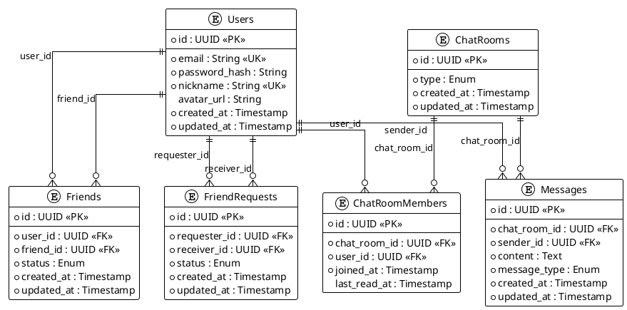

# 데이터베이스 설계

[← 아키텍처 개요](./index)

---

## 목차

- [주요 엔티티](#주요-엔티티)
- [ER 다이어그램](#er-다이어그램)

---

## 주요 엔티티

### Users (사용자)

| 컬럼 | 타입 | 설명 |
|------|------|------|
| id | UUID, PK | 사용자 ID |
| email | String, Unique | 이메일 |
| password_hash | String | 해시된 비밀번호 |
| nickname | String, Unique | 닉네임 |
| avatar_url | String, Optional | 프로필 이미지 |
| created_at | Timestamp | 생성일 |
| updated_at | Timestamp | 수정일 |

### Friends (친구 관계)

| 컬럼 | 타입 | 설명 |
|------|------|------|
| id | UUID, PK | 관계 ID |
| user_id | UUID, FK → Users | 사용자 ID |
| friend_id | UUID, FK → Users | 친구 ID |
| status | Enum | 'pending', 'accepted', 'blocked' |
| created_at | Timestamp | 생성일 |
| updated_at | Timestamp | 수정일 |

> **제약**: (user_id, friend_id) Unique

### FriendRequests (친구 요청)

| 컬럼 | 타입 | 설명 |
|------|------|------|
| id | UUID, PK | 요청 ID |
| requester_id | UUID, FK → Users | 요청자 ID |
| receiver_id | UUID, FK → Users | 수신자 ID |
| status | Enum | 'pending', 'accepted', 'rejected' |
| created_at | Timestamp | 생성일 |
| updated_at | Timestamp | 수정일 |

### ChatRooms (채팅방)

| 컬럼 | 타입 | 설명 |
|------|------|------|
| id | UUID, PK | 채팅방 ID |
| type | Enum | 'direct', 'group' (초기에는 'direct'만) |
| created_at | Timestamp | 생성일 |
| updated_at | Timestamp | 수정일 |

### ChatRoomMembers (채팅방 멤버)

| 컬럼 | 타입 | 설명 |
|------|------|------|
| id | UUID, PK | 멤버 ID |
| chat_room_id | UUID, FK → ChatRooms | 채팅방 ID |
| user_id | UUID, FK → Users | 사용자 ID |
| joined_at | Timestamp | 입장일 |
| last_read_at | Timestamp | 마지막 읽음 시간 |

### Messages (메시지)

| 컬럼 | 타입 | 설명 |
|------|------|------|
| id | UUID, PK | 메시지 ID |
| chat_room_id | UUID, FK → ChatRooms | 채팅방 ID |
| sender_id | UUID, FK → Users | 발신자 ID |
| content | Text | 메시지 내용 |
| message_type | Enum | 'text', 'image', 'file' (초기에는 'text'만) |
| created_at | Timestamp | 생성일 |
| updated_at | Timestamp | 수정일 |

> **인덱스**: (chat_room_id, created_at)

---

## ER 다이어그램

---

## 다음 문서

→ [API 설계](./api)
