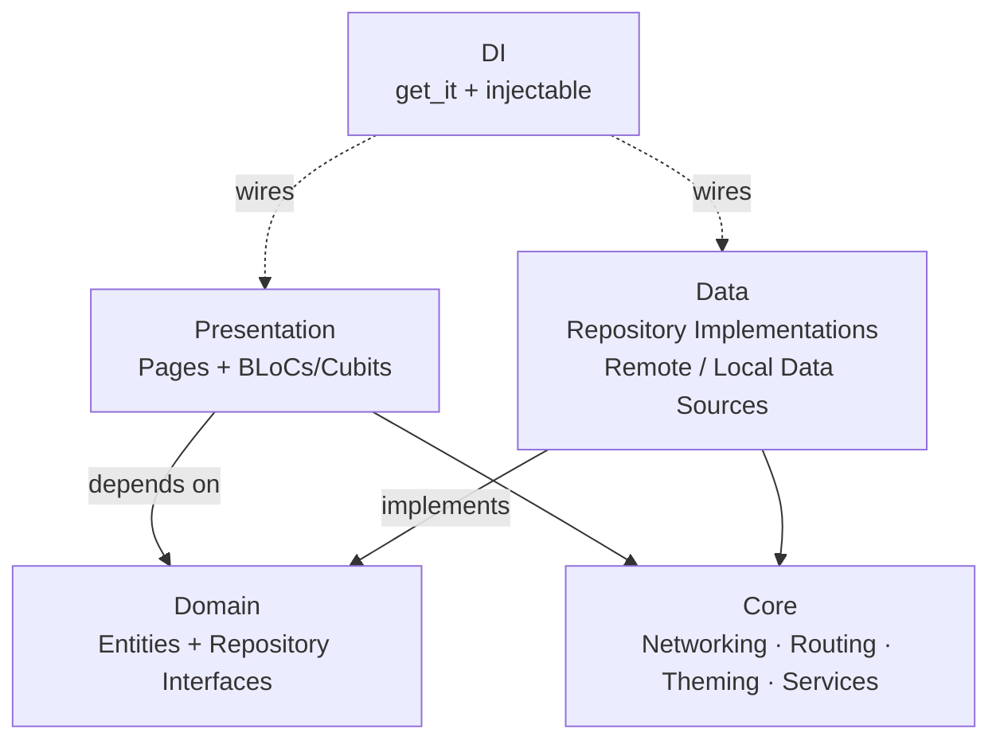
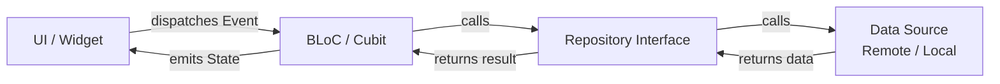
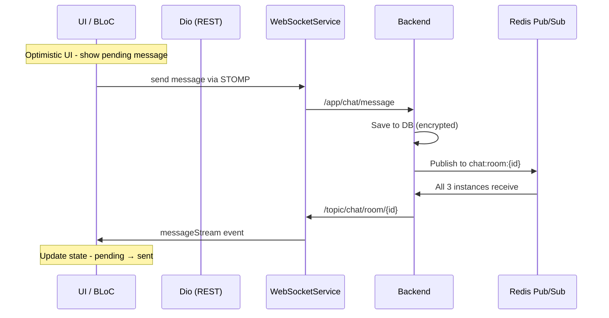
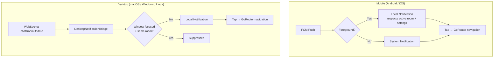

# Frontend Architecture (Flutter)

[← Architecture Overview](./index)

---

## Table of Contents

- [Overview](#overview)
- [Architecture Layers](#architecture-layers)
- [State Management](#state-management)
- [Screens](#screens)
- [Networking](#networking)
- [Local Database](#local-database)
- [Key Patterns](#key-patterns)
- [Multi-Platform Notifications](#multi-platform-notifications)
- [Theme](#theme)
- [Dependencies](#dependencies)

---

## Overview

| Item | Detail |
|------|--------|
| **Framework** | Flutter 3.8+ |
| **Dart SDK** | ^3.8.1 |
| **Version** | 1.0.0+2 |
| **Architecture** | Clean Layered Architecture (Presentation → Domain ← Data) |
| **State Management** | BLoC/Cubit pattern (flutter_bloc) |
| **DI** | get_it + injectable (compile-time safe, environment-based) |
| **Routing** | GoRouter with auth redirect guards |
| **Platforms** | Android, iOS, macOS, Windows, Linux |

---

## Architecture Layers

| Layer | Purpose |
|-------|---------|
| **Presentation** | Pages (UI widgets) + BLoCs/Cubits (state management). Pages are thin — all logic delegated to BLoC event handlers. |
| **Domain** | Pure Dart entities (no framework dependencies) + abstract repository interfaces. Contract layer decoupling presentation from data. |
| **Data** | Repository implementations, remote data sources (Dio HTTP), local data sources (FlutterSecureStorage, SharedPreferences), local database (Drift/SQLite). |
| **Core** | Cross-cutting concerns — networking (Dio, WebSocket/STOMP), routing (GoRouter), theming, services (FCM, biometric, deep links, desktop notifications), error handling. |
| **DI** | get_it + injectable for compile-time-safe dependency injection with environment-based registration (mobile vs desktop). |

**Dependency direction**: `Presentation → Domain ← Data` (domain at center, no outward dependencies)

---

## State Management

### BLoC Pattern

### Key BLoCs (`@injectable`)

| BLoC | Responsibility |
|------|---------------|
| `AuthBloc` | Authentication, login, signup, profile update, avatar upload, WebSocket connection management, FCM token registration |
| `ChatListBloc` (`@lazySingleton`) | Chat room list, real-time updates via WebSocket (chat room updates, read receipts, online status), sort by activity |
| `ChatRoomBloc` | Room lifecycle (open/close/foreground/background), message sending with optimistic UI, WebSocket subscriptions, read receipts (debounce), typing indicators (auto-timeout), reactions, reply/forward, file upload, presence, gap recovery on reconnection, blocked user filtering |
| `FriendBloc` | Friends, requests, search, block/hide, online status updates, profile update propagation, optimistic UI |
| `MessageSearchBloc` | FTS5-powered local message search with rxdart debounce (300ms), minimum 2-character query |
| `AccountDeletionBloc` | Multi-step deletion (password → confirmation text → final delete) |
| `ChangePasswordBloc` | Current password verification + new password |
| `ForgotPasswordBloc` | Email-based password reset flow |
| `FindEmailBloc` | Find email by nickname + phone |
| `EmailVerificationBloc` | Post-signup email verification |

### Key Cubits

| Cubit | Scope | Responsibility |
|-------|-------|---------------|
| `ThemeCubit` | `@lazySingleton` | Light / dark / system theme, persisted via local storage |
| `ChatSettingsCubit` | `@lazySingleton` | Font size (0.8–1.4), auto-download toggles (wifi/mobile), typing indicator, cache clearing |
| `NotificationSettingsCubit` | `@lazySingleton` | Message/friend/group notifications, preview mode (nameAndMessage/nameOnly/nothing), sound, vibration, DND; optimistic UI with rollback |
| `AppLockCubit` | `@lazySingleton` | Biometric lock on resume/launch, 30-second grace period, cached biometric state |
| `BiometricSettingsCubit` | `@injectable` | Biometric support detection, enable/disable toggle with auth confirmation |

---

## Screens

30+ screens organized by domain:

| Domain | Screens |
|--------|---------|
| **Auth** | Splash, Login, SignUp, Email Verification, Find Email, Forgot Password |
| **Main** | Friends tab + Chat tab (`NavigationBar` on mobile / `NavigationRail` on desktop), unread badge |
| **Friends** | Friend List, Friend Settings, Received Requests, Sent Requests, Hidden Friends, Blocked Users |
| **Chat** | Chat List, Chat Room (messages, input, reactions, reply, forward, file upload), Direct Chat, Self Chat |
| **Profile** | My Profile, Edit Profile, View Profile |
| **Settings** | Settings Hub, Notification Settings, Chat Settings, Security Settings, Change Password, Account Deletion, Terms, Privacy Policy |
| **Other** | Report (user/message), App Lock (biometric overlay), Error fallback |

---

## Networking

### REST (Dio)

- Singleton `DioClient` with auth interceptor
- `AuthInterceptor` (`QueuedInterceptor`): auto JWT injection → 401 token refresh via separate Dio instance → retry original request → 404 `USER_NOT_FOUND` force-logout
- `CertificatePinningInterceptor`: SHA-256 certificate validation (production-ready, disabled in dev)
- Environment-based URLs: dev=`localhost:8080`, prod=NAS HTTPS

### WebSocket (STOMP)

`WebSocketService` is a **facade** composing four internal managers:

| Manager | Responsibility |
|---------|---------------|
| `ConnectionManager` | Connect/disconnect, exponential backoff auto-reconnect |
| `SubscriptionManager` | Room + user channel subscriptions, restore on reconnect |
| `MessageSender` | Outbound STOMP frames |
| `PayloadParser` | Deserialize incoming frames to typed events |

**Event Streams**:

| Stream | Data |
|--------|------|
| `messageStream` | Chat messages (text, image, file, system) |
| `reactionStream` | Reaction added/removed events |
| `readStream` | Read receipt events |
| `typingStream` | Typing indicator events |
| `onlineStatusStream` | User online status changes |
| `messageDeletedStream` | Message deletion events |
| `messageUpdatedStream` | Message edit events |
| `linkPreviewStream` | Link preview update events |
| `profileUpdateStream` | User profile change events |
| `errorStream` | Server error events |
| `chatRoomUpdateStream` | Chat list update events |

**Additional behaviors**:
- Event deduplication via `EventDedupeCache` with TTL and max size
- Gap recovery on reconnection (fetch missed messages)
- Independent token refresh for WebSocket reconnection

### Data Flow

---

## Local Database

**Library**: Drift (SQLite) with FTS5 full-text search

| Table | Purpose |
|-------|---------|
| `Messages` | Cached chat messages for offline-first loading |
| `ChatRooms` | Cached room metadata |
| `MessageReactions` | Cached reaction data |

**FTS5 Virtual Table**: Sync triggers on Messages table for full-text search on message content and file names.

**Offline-First Strategy**:
1. On room open → load cached messages from SQLite (instant)
2. Display cached messages immediately
3. Fetch latest from server in background
4. Merge/replace cache → update UI
5. On WebSocket message → add to cache + emit to UI
6. On reconnection → gap recovery fetches missed messages

---

## Key Patterns

| Pattern | Where Applied |
|---------|--------------|
| **Optimistic UI** | Messages (pending → sent → failed), reactions (add/remove immediately, server echo confirms), friend hide/block (remove from list, rollback on API failure) |
| **Facade** | `WebSocketService` composes 4 internal managers behind a single unified API |
| **Manager Decomposition** | `ChatRoomBloc` delegates to `PresenceManager`, `MessageCacheManager`, `MessageHandler`, `WebSocketSubscriptionManager` to avoid a god-class |
| **Platform Strategy** | `FcmServiceImpl` (mobile) vs `NoOpFcmService` (desktop) via injectable `@Environment` |
| **Debounce** | `markAsRead` 500ms + 2s retry, message search 300ms (rxdart) |
| **Grace Period** | `AppLockCubit` 30-second window after authentication to avoid re-locking on brief background transitions |
| **Event Deduplication** | `EventDedupeCache` with TTL prevents duplicate WebSocket messages during reconnection |
| **Repository Pattern** | Abstract interfaces in domain, concrete implementations in data layer |

---

## Multi-Platform Notifications

| Platform | Source | Foreground | Background | Tap Action |
|----------|--------|-----------|-----------|------------|
| **Mobile** | FCM push | Local notification (respects active room + notification settings) | System notification | GoRouter navigation |
| **Desktop** | WebSocket `chatRoomUpdate` | Suppressed if window focused + same room active | Local notification via `DesktopNotificationBridge` | GoRouter navigation |

---

## Theme

- **Design System**: Material 3
- **Primary Color**: Violet `#8B5CF6` with light/dark variants
- **Modes**: Light, Dark, System (auto-switch)
- **Color Extension**: Context-based `AppColors` extension for easy dark mode access
- **Text Scaling**: Global text scale factor driven by `ChatSettingsCubit` font size setting (0.8–1.4x)
- **Fonts**: Inter (text) + JetBrains Mono (code)

---

## Dependencies

42 total dependencies:

| Category | Packages |
|----------|---------|
| **State** | `flutter_bloc`, `equatable`, `rxdart` |
| **Network** | `dio`, `stomp_dart_client` |
| **Storage** | `flutter_secure_storage`, `shared_preferences`, `drift` (SQLite) |
| **DI** | `get_it`, `injectable` |
| **Routing** | `go_router` |
| **Media** | `image_picker`, `image_cropper`, `pro_image_editor`, `video_player`, `chewie`, `emoji_picker_flutter`, `file_picker` |
| **Push** | `firebase_core`, `firebase_messaging`, `flutter_local_notifications` |
| **Security** | `local_auth`, `firebase_app_check` |
| **Desktop** | `window_manager` |
| **UI** | `cached_network_image`, `shimmer`, `flutter_slidable` |
| **Serialization** | `json_annotation`, `json_serializable` |

**Dev Dependencies**: `build_runner`, `injectable_generator`, `json_serializable`, `drift_dev`, `mocktail`, `bloc_test`, `flutter_launcher_icons`, `msix`

---

## Next

→ [Database Design](./database)
