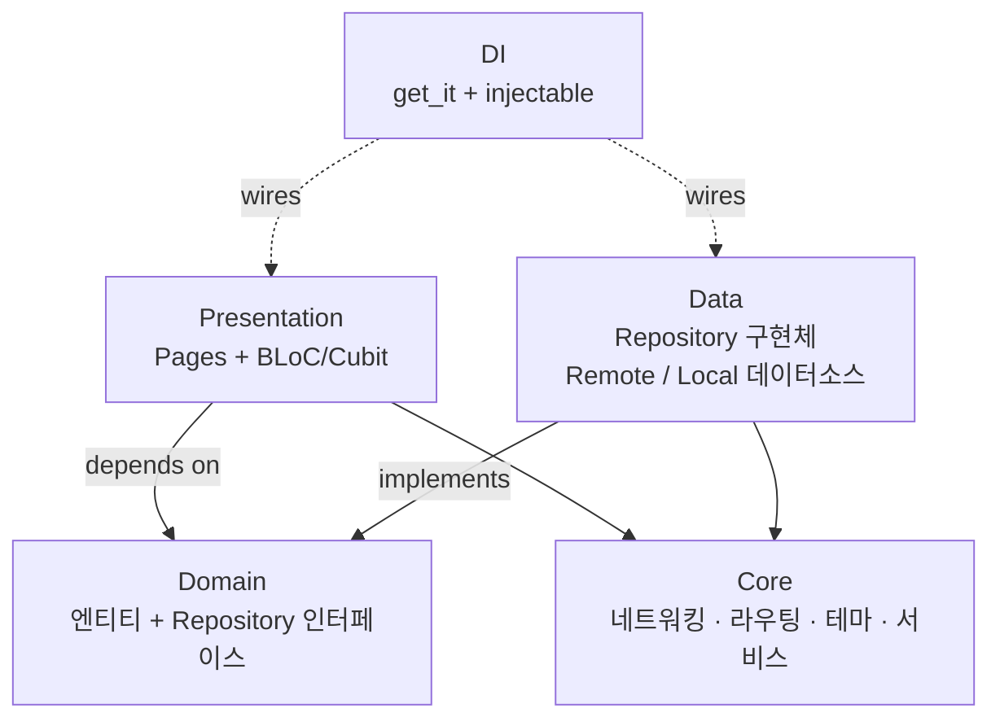

# 프론트엔드 아키텍처 (Flutter)

[← 아키텍처 개요](./index)

---

## 요약

| 항목 | 내용 |
|------|------|
| **프레임워크** | Flutter 3.8+ (Dart SDK ^3.8.1) |
| **아키텍처** | Clean Layered (Presentation → Domain ← Data) |
| **상태 관리** | BLoC/Cubit (flutter_bloc) |
| **DI** | get_it + injectable |
| **라우팅** | GoRouter (인증 가드) |
| **플랫폼** | Android · iOS · macOS · Windows · Linux |

---

## 아키텍처 레이어

| 레이어 | 역할 |
|--------|------|
| **Presentation** | UI 위젯 + BLoC/Cubit. 페이지는 얇게, 로직은 BLoC에 위임 |
| **Domain** | 순수 Dart 엔티티 + 추상 Repository 인터페이스 |
| **Data** | Repository 구현체, Dio HTTP, Drift SQLite, SecureStorage |
| **Core** | 네트워킹, WebSocket, 라우팅, 테마, FCM, 에러 처리 |

---

## 주요 BLoC / Cubit

### BLoC (`@injectable`)

| BLoC | 역할 |
|------|------|
| `AuthBloc` | 로그인, 회원가입, 프로필, WebSocket 연결, FCM 토큰 |
| `ChatListBloc` (`@lazySingleton`) | 채팅방 목록, 실시간 업데이트, 읽음/온라인 |
| `ChatRoomBloc` | 메시지 전송 (Optimistic UI), 리액션, 타이핑, 프레즌스, 파일 업로드 |
| `FriendBloc` | 친구 요청/수락, 차단/숨김, Optimistic UI |
| `MessageSearchBloc` | FTS5 로컬 검색 (rxdart 300ms debounce) |

### Cubit (`@lazySingleton`)

| Cubit | 역할 |
|-------|------|
| `ThemeCubit` | 라이트/다크/시스템 테마 |
| `ChatSettingsCubit` | 폰트 크기 (0.8~1.4x), 자동 다운로드, 타이핑 표시 |
| `NotificationSettingsCubit` | 알림 설정, DND, 미리보기 모드 |
| `AppLockCubit` | 생체인증 잠금 (30초 grace period) |

---

## 네트워킹

### REST (Dio)

- `AuthInterceptor` (QueuedInterceptor): JWT 자동 삽입 → 401 시 토큰 갱신 → 재시도
- `CertificatePinningInterceptor`: SHA-256 인증서 검증 (프로덕션)
- 환경별 URL: dev=localhost, prod=NAS HTTPS

### WebSocket (STOMP)

`WebSocketService` — 4개 내부 매니저를 조합한 Facade 패턴:

| 매니저 | 역할 |
|--------|------|
| `ConnectionManager` | 연결/해제, 지수 백오프 재연결 |
| `SubscriptionManager` | 채널 구독, 재연결 시 복원 |
| `MessageSender` | STOMP 프레임 전송 |
| `PayloadParser` | 수신 프레임 → 타입 이벤트 역직렬화 |

**주요 스트림**: messageStream · reactionStream · readStream · typingStream · onlineStatusStream · messageDeletedStream · messageUpdatedStream · linkPreviewStream · chatRoomUpdateStream

---

## 로컬 DB (Drift + FTS5)

| 테이블 | 용도 |
|--------|------|
| Messages | 오프라인 메시지 캐시 |
| ChatRooms | 채팅방 메타데이터 |
| MessageReactions | 리액션 캐시 |

**오프라인 우선**: SQLite 캐시 즉시 표시 → 서버 fetch → 병합 → WebSocket 실시간 반영

---

## 화면 구성 (30+)

| 도메인 | 화면 |
|--------|------|
| **인증** | Splash, Login, SignUp, Email 인증, 비밀번호 찾기 |
| **메인** | 친구 탭 + 채팅 탭 (모바일: NavigationBar / 데스크톱: NavigationRail) |
| **채팅** | 채팅 목록, 채팅방, 1:1 채팅, 셀프 채팅 |
| **친구** | 친구 목록, 요청 보기, 숨김/차단 관리 |
| **프로필** | 내 프로필, 편집, 타인 프로필 |
| **설정** | 알림, 채팅, 보안, 비밀번호, 계정 삭제, 약관 |

---

## 주요 패턴

| 패턴 | 적용 |
|------|------|
| **Optimistic UI** | 메시지 (pending→sent→failed), 리액션, 친구 숨김/차단 |
| **Facade** | WebSocketService (4개 매니저 통합) |
| **매니저 분해** | ChatRoomBloc → Presence, Cache, Handler, Subscription 매니저 |
| **플랫폼 전략** | FCM (모바일) vs NoOpFCM (데스크톱) via `@Environment` |
| **이벤트 중복 제거** | EventDedupeCache (TTL + max size) |

---

## 멀티 플랫폼 알림

| 플랫폼 | 소스 | 포그라운드 | 백그라운드 |
|--------|------|-----------|-----------|
| **모바일** | FCM 푸시 | 로컬 알림 (활성 채팅방 제외) | 시스템 알림 |
| **데스크톱** | WebSocket chatRoomUpdate | 포커스+같은 방이면 무시 | 로컬 알림 |

---

→ [데이터베이스 설계](./database)
