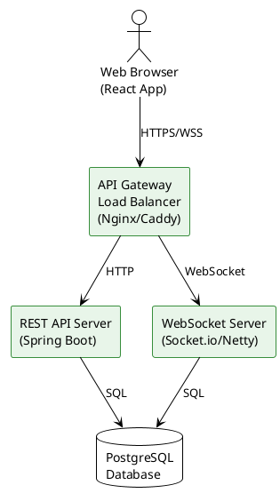

# Co-Talk 아키텍처

MVP 버전의 시스템 아키텍처 문서입니다.

---

## 목차

| 문서 | 설명 |
|------|------|
| [백엔드 구조](./backend) | 서버 구조, 컴포넌트, 레이어 |
| [프론트엔드 구조](./frontend) | React 앱 구조, 상태 관리 |
| [데이터베이스 설계](./database) | ERD, 테이블 설계, 인덱스 |
| [API 설계](./api) | REST API, WebSocket 이벤트 |
| [인프라](./infrastructure) | 배포, 보안, 모니터링 |

---

## 전체 아키텍처 다이어그램

---

## 대규모 트래픽

100만+ 동시 접속자를 위한 확장 아키텍처는 별도 문서를 참조하세요.

→ [대규모 트래픽 아키텍처](../ARCHITECTURE-SCALE)
