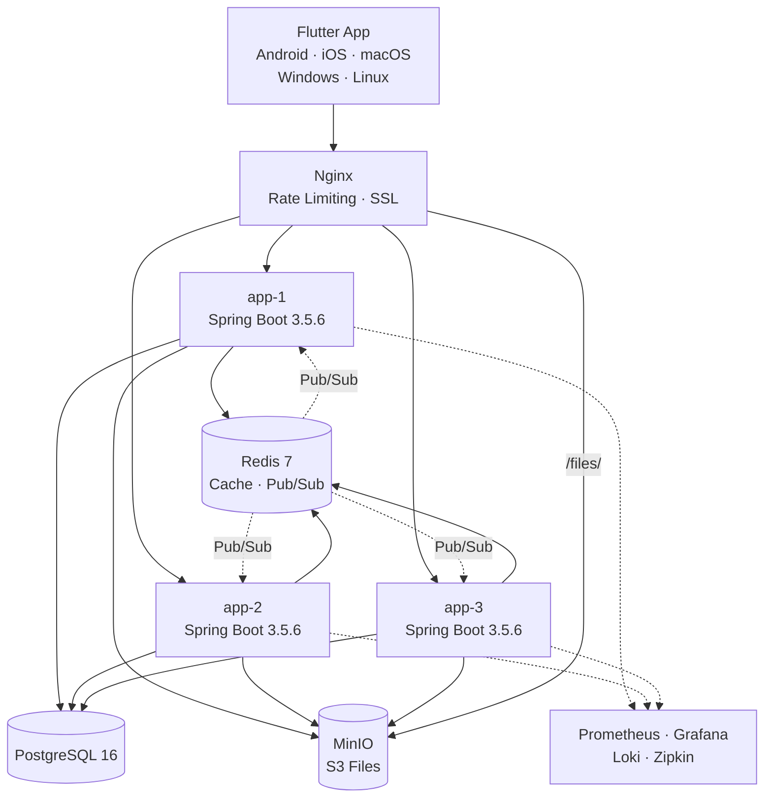

# Co-Talk Architecture

시스템 아키텍처 문서입니다.

---

## 목차

| 문서 | 설명 |
|------|------|
| [백엔드 구조](./backend) | Hexagonal Architecture, Spring Boot 3.5.6, WebSocket |
| [프론트엔드 구조](./frontend) | Flutter, BLoC/Cubit, Drift, GoRouter |
| [데이터베이스 설계](./database) | ERD, 16개 테이블, 인덱스, Flyway |
| [API 설계](./api) | 68개 REST 엔드포인트, STOMP WebSocket |
| [인프라](./infrastructure) | Docker Compose, 카나리아 배포, 모니터링 |

---

## 전체 아키텍처 다이어그램

---

## 기술 스택 요약

| Component | Technology |
|-----------|-----------|
| **Backend** | Java 25 + Spring Boot 3.5.6 (Virtual Threads) |
| **Frontend** | Flutter 3.8+ (Dart SDK ^3.8.1) |
| **Database** | PostgreSQL 16 + Spring Data JPA + QueryDSL |
| **Cache** | Redis 7 (RedisCacheManager) |
| **Real-Time** | STOMP over WebSocket + Redis Pub/Sub |
| **Storage** | MinIO (S3-compatible) |
| **Deployment** | Docker Compose on NAS (3 instances, canary rolling) |
| **CI/CD** | GitHub Actions → GHCR → deploy.sh |
| **Monitoring** | Prometheus + Grafana + Loki + Zipkin + Alertmanager |
