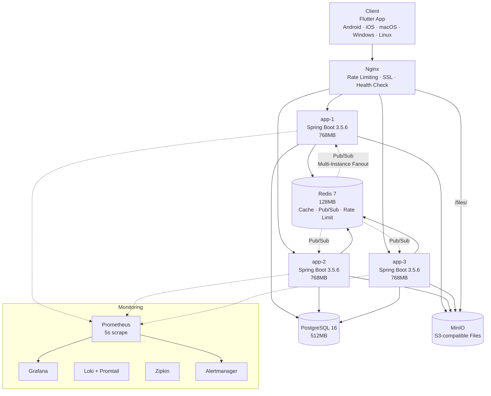
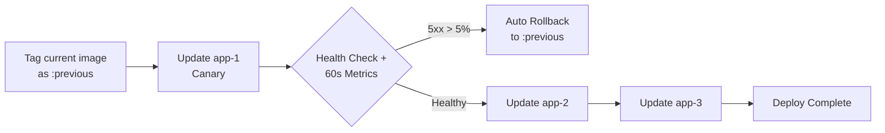

# Infrastructure & Deployment

[← Architecture Overview](./index)

---

## Table of Contents

- [Production Environment](#production-environment)
- [Architecture Diagram](#architecture-diagram)
- [Deployment Strategy](#deployment-strategy)
- [Nginx Configuration](#nginx-configuration)
- [Monitoring Stack](#monitoring-stack)
- [CI/CD Pipeline](#cicd-pipeline)
- [Backup Strategy](#backup-strategy)
- [Development Environment](#development-environment)

---

## Production Environment

### Platform

| Item | Detail |
|------|--------|
| **Host** | Synology NAS (8GB RAM) |
| **Orchestration** | Docker Compose |
| **Strategy** | Canary Rolling Deployment (3 instances) |
| **Reverse Proxy** | Nginx (round-robin + passive health check) |
| **Graceful Shutdown** | 30-second timeout |
| **CI/CD** | GitHub Actions → GHCR → deploy.sh |

### Service Composition

| Service | Image | Memory | Role |
|---------|-------|--------|------|
| app-1, app-2, app-3 | GHCR co-talk | 768MB each | Spring Boot 3.5.6 |
| nginx | nginx:alpine | - | Reverse proxy, rate limiting, SSL |
| postgres | postgres:16-alpine | 512MB | Primary database |
| redis | redis:7-alpine | 128MB | Cache, Pub/Sub, rate limiting |
| minio | minio/minio | - | S3-compatible file storage |
| prometheus | prom/prometheus | - | Metrics collection (5s scrape) |
| grafana | grafana/grafana:10.2.2 | - | Dashboards |
| loki | grafana/loki:2.9.2 | - | Log aggregation |
| promtail | grafana/promtail:2.9.2 | - | Docker log collection |
| zipkin | openzipkin/zipkin | - | Distributed tracing |
| alertmanager | prom/alertmanager | - | Slack/email alerts |

**Total Resource Usage**: ~4.5GB / 8GB

---

## Architecture Diagram



---

## Deployment Strategy

### Canary Rolling Deployment



**Flow**:
1. Backup current image as `:previous` tag
2. Update app-1 only (canary) → health check → 60-second metric verification
3. If 5xx error rate > 5% → automatic rollback to `:previous`
4. On success → sequential rollout to app-2, then app-3

**Graceful Shutdown**:
```yaml
server:
  shutdown: graceful
spring:
  lifecycle:
    timeout-per-shutdown-phase: 30s
```

---

## Nginx Configuration

### Rate Limiting

| Zone | Limit | Target |
|------|-------|--------|
| auth | 5 req/min | Login, signup, password reset |
| websocket | 10 req/sec | WebSocket upgrade |
| general | 30 req/sec | All other endpoints |

### Routing

| Path | Target |
|------|--------|
| `/ws` | WebSocket upgrade → app instances |
| `/files/` | MinIO proxy (MinIO port not exposed externally) |
| `/api/**` | REST API → app instances |
| `/actuator/prometheus` | Metrics (internal only) |

### Security Headers

| Header | Value |
|--------|-------|
| HSTS | max-age=1yr, includeSubDomains, preload |
| CSP | Content Security Policy |
| X-Frame-Options | DENY |
| X-Content-Type-Options | nosniff |

### Load Balancing

- 3 upstream backends (app-1, app-2, app-3)
- Passive health check
- K6 bypass token for load testing

---

## Monitoring Stack

### Prometheus (5-second scrape)

- 3 instance endpoints: `/actuator/prometheus`
- **Custom Metrics**:
  - Messages sent/received count
  - Login count
  - WebSocket active connections
  - Redis publish/delivery rates

### Grafana (Provisioned Dashboards)

- Application performance
- WebSocket connections
- Redis operations
- JVM metrics (heap, threads, GC)

### Loki + Promtail

- Docker container log collection (regex: `app-1|app-2|app-3`)
- Structured JSON logging via Logstash Logback Encoder

### Zipkin

- Distributed tracing via Micrometer Tracing (Brave bridge)
- Trace propagation across 3 instances

### Alertmanager Rules

| Rule | Severity |
|------|----------|
| InstanceDown | warning |
| MultipleInstancesDown | critical |
| High 5xx error rate | critical |
| Slow response time | warning |
| CPU/Memory exceeded | warning |
| DB connection pool exhaustion | critical |
| Redis publish failure | critical |
| WebSocket delivery failure | critical |
| Inter-instance delivery imbalance | warning |

---

## CI/CD Pipeline


### Docker Build

```dockerfile
# Build stage
FROM gradle:jdk25-alpine AS build
# Run stage
FROM eclipse-temurin:25-jre-alpine
```

**JVM Options**:
```
-XX:+UseContainerSupport
-XX:MaxRAMPercentage=75.0
-XX:InitialRAMPercentage=50.0
-XX:+UseG1GC
-XX:+UseStringDeduplication
```

---

## Backup Strategy

### PostgreSQL Backup

```bash
# Manual backup
docker compose -f docker-compose.backup.yml run --rm backup

# Automated backup (cron)
docker compose -f docker-compose.backup.yml up -d backup-cron
```

- Daily automated backups via cron
- Backup/restore scripts in `docker/backup/`

---

## Development Environment

### Required Tools

| Tool | Version |
|------|---------|
| Java | 25 (via Foojay toolchain resolver) |
| Gradle | 8.x (wrapper included) |
| Docker | Latest |
| PostgreSQL | 16 |
| Redis | 7 |

### Quick Commands

```bash
# Build
./gradlew build

# Run tests
./gradlew test

# Run locally
./gradlew bootRun
```

### Environment Variables (Required)

```
DB_PASSWORD, JWT_SECRET, ENCRYPTION_KEY,
MINIO_ACCESS_KEY, MINIO_SECRET_KEY, MINIO_PUBLIC_URL
```

See `.env.example` for full template.

---

## Next

→ [Tech Stack Overview](../tech-stack/index)
