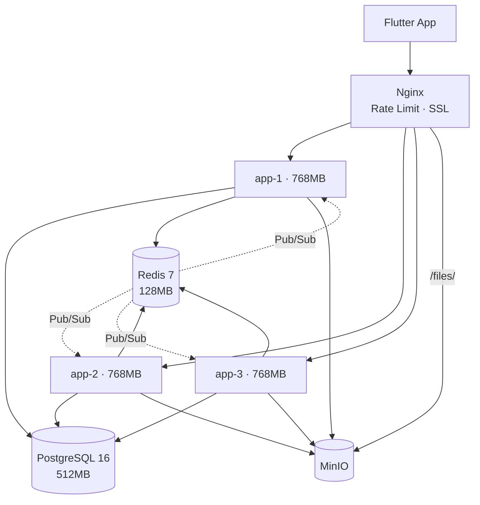
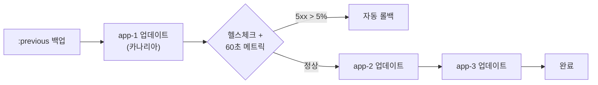
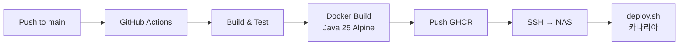

# 인프라 및 배포

[← 아키텍처 개요](./index)

---

## 요약

| 항목 | 내용 |
|------|------|
| **호스트** | Synology NAS (8GB RAM) |
| **오케스트레이션** | Docker Compose |
| **배포 전략** | 카나리아 롤링 (3개 인스턴스) |
| **리버스 프록시** | Nginx (round-robin, passive health check) |
| **CI/CD** | GitHub Actions → GHCR → deploy.sh |
| **총 리소스** | ~4.5GB / 8GB |

---

## 아키텍처 다이어그램



---

## 서비스 구성

| 서비스 | 이미지 | 메모리 | 역할 |
|--------|-------|--------|------|
| app-1/2/3 | GHCR co-talk | 768MB × 3 | Spring Boot 3.5.6 |
| nginx | nginx:alpine | - | 리버스 프록시, Rate Limiting |
| postgres | postgres:16-alpine | 512MB | 주 DB |
| redis | redis:7-alpine | 128MB | 캐시, Pub/Sub, Rate Limit |
| minio | minio/minio | - | S3 파일 스토리지 |
| prometheus | prom/prometheus | - | 메트릭 (5초 스크래핑) |
| grafana | grafana:10.2.2 | - | 대시보드 |
| loki + promtail | grafana/loki:2.9.2 | - | 로그 집계 |
| zipkin | openzipkin/zipkin | - | 분산 추적 |
| alertmanager | prom/alertmanager | - | Slack/이메일 알림 |

---

## 카나리아 배포



1. 현재 이미지를 `:previous`로 태그
2. app-1만 업데이트 → 헬스체크 → 60초 메트릭 검증
3. 5xx 에러율 > 5% → `:previous`로 자동 롤백
4. 정상 → app-2, app-3 순차 배포

---

## Nginx 설정

| 기능 | 설정 |
|------|------|
| **Rate Limit** | auth 5r/m, WebSocket 10r/s, general 30r/s |
| **WebSocket** | `/ws` → Upgrade 헤더 처리 |
| **파일 프록시** | `/files/` → MinIO (외부 포트 미노출) |
| **보안 헤더** | HSTS, CSP, X-Frame-Options, X-Content-Type-Options |
| **로드 밸런싱** | 3 upstream, passive health check |

---

## 모니터링

### Alertmanager 알림 규칙

| 규칙 | 심각도 |
|------|--------|
| InstanceDown | warning |
| MultipleInstancesDown | critical |
| 5xx 에러율 높음 | critical |
| 응답 시간 느림 | warning |
| CPU/메모리 초과 | warning |
| DB 커넥션 풀 소진 | critical |
| Redis publish 실패 | critical |

---

## CI/CD



---

## 백업

```bash
# 수동 백업
docker compose -f docker-compose.backup.yml run --rm backup

# 자동 백업 (cron)
docker compose -f docker-compose.backup.yml up -d backup-cron
```

---

→ [기술 스택 개요](../tech-stack/)
