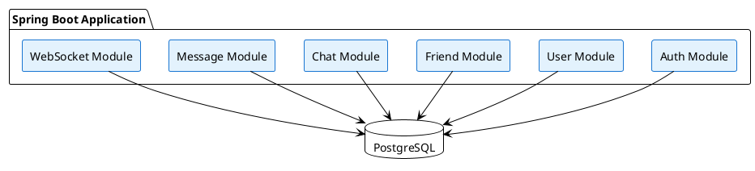
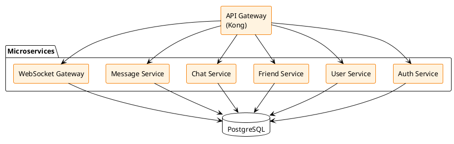

# MSA vs 모놀리식 아키텍처 결정

[← 기술 결정 목록](./index)

**결정**: 모듈형 모놀리식 → 점진적 MSA 전환
**상태**: 승인됨

---

## 목차

- [결정 배경](#1-결정-배경)
- [옵션 비교](#2-옵션-비교)
- [최종 결정](#3-최종-결정)
- [구현 전략](#4-구현-전략)
- [마이그레이션 계획](#5-마이그레이션-계획)

---

## 1. 결정 배경

Co-Talk 프로젝트는 대규모 트래픽(100만+ 동시 접속자)을 목표로 하며, 초기 MVP 단계에서 빠른 개발과 배포가 필요합니다. 아키텍처 패턴 선택은 프로젝트의 성공에 중요한 영향을 미칩니다.

---

## 2. 옵션 비교

### 2.1 모놀리식 아키텍처 (Monolithic Architecture)

#### 구조



#### 장점
1. **개발 속도**
   - 단일 코드베이스로 빠른 개발
   - 로컬 개발 환경 구성 간단
   - 디버깅 용이

2. **배포 단순성**
   - 단일 애플리케이션 배포
   - 버전 관리 간단
   - 롤백 용이

3. **트랜잭션 관리**
   - 단일 데이터베이스 트랜잭션
   - ACID 보장 용이
   - 친구 추가, 메시지 전송 등 복잡한 트랜잭션 처리 간단

4. **초기 비용**
   - 인프라 비용 낮음
   - 모니터링 도구 단순
   - 운영 복잡도 낮음

5. **성능**
   - 서비스 간 네트워크 호출 없음
   - 메모리 내 함수 호출로 빠름
   - 데이터 일관성 보장 용이

#### 단점
1. **확장성 제한**
   - 전체 애플리케이션 스케일링 필요
   - 특정 기능만 확장 불가
   - 리소스 낭비 가능

2. **기술 스택 제약**
   - 전체가 동일한 기술 스택 사용
   - 특정 서비스에 최적화된 기술 사용 어려움

3. **장애 전파**
   - 한 모듈의 장애가 전체에 영향
   - 격리 어려움

4. **팀 협업**
   - 대규모 팀에서 충돌 가능
   - 코드 리뷰 부담 증가

---

### 2.2 마이크로서비스 아키텍처 (MSA)

#### 구조



#### 장점
1. **독립적 확장**
   - 서비스별 독립적 스케일링
   - WebSocket 서버만 확장 가능
   - 리소스 효율적 사용

2. **기술 다양성**
   - 서비스별 최적 기술 선택 가능
   - 점진적 기술 스택 업그레이드

3. **장애 격리**
   - 서비스별 독립 배포
   - 장애 전파 최소화
   - 부분적 장애 허용

4. **팀 독립성**
   - 팀별 독립적 개발/배포
   - 소유권 명확
   - 병렬 개발 가능

5. **재사용성**
   - 서비스를 다른 프로젝트에서 재사용
   - API로 외부 노출 가능

#### 단점
1. **복잡도 증가**
   - 분산 시스템 복잡도
   - 네트워크 지연
   - 분산 트랜잭션 관리 어려움

2. **개발 속도**
   - 초기 설정 복잡
   - 로컬 개발 환경 구성 어려움
   - 디버깅 복잡

3. **운영 복잡도**
   - 서비스 디스커버리 필요
   - 로드 밸런싱 복잡
   - 모니터링 도구 필요
   - 분산 추적 필요

4. **데이터 일관성**
   - 분산 트랜잭션 어려움
   - 이벤트 소싱/사가 패턴 필요
   - 최종 일관성 수용 필요

5. **비용**
   - 인프라 비용 증가
   - 모니터링 도구 비용
   - 네트워크 비용

---

## 3. Co-Talk 프로젝트 분석

### 3.1 프로젝트 특성

#### 초기 단계 (MVP)
- **팀 규모**: 소규모 (2-5명)
- **개발 기간**: 1-3개월
- **트래픽**: 낮음 (1,000명 이하)
- **기능**: 기본 기능만 (1:1 채팅, 친구 관리)

#### 확장 단계
- **팀 규모**: 중규모 (5-10명)
- **트래픽**: 중간 (10만명)
- **기능**: 그룹 채팅, 파일 전송 등

#### 대규모 단계
- **팀 규모**: 대규모 (10명+)
- **트래픽**: 높음 (100만+)
- **기능**: 검색, 알림, AI 기능 등

### 3.2 서비스 경계 분석

#### 도메인 분석
1. **인증/인가 (Auth)**
   - 독립적 기능
   - 다른 서비스와 약한 결합
   - 확장 필요성 낮음

2. **사용자 관리 (User)**
   - 프로필 관리
   - 검색 기능
   - 확장 필요성 중간

3. **친구 관리 (Friend)**
   - 친구 요청/수락
   - 친구 목록
   - Chat 서비스와 강한 결합

4. **채팅 (Chat)**
   - 채팅방 관리
   - Message와 강한 결합
   - 확장 필요성 높음

5. **메시지 (Message)**
   - 메시지 전송/저장
   - WebSocket과 강한 결합
   - 확장 필요성 매우 높음

6. **WebSocket Gateway**
   - 실시간 통신
   - 독립적 확장 필요
   - 확장 필요성 매우 높음

#### 결합도 분석
- **강한 결합**: Chat ↔ Message ↔ WebSocket
- **중간 결합**: Friend ↔ Chat
- **약한 결합**: Auth ↔ User

---

## 4. 최종 결정

### ✅ **결정: 모듈형 모놀리식 (Modular Monolith) → 점진적 MSA 전환**

### 4.1 초기 단계: 모듈형 모놀리식

**구조:**
```
Spring Boot Application
├── auth (인증/인가 모듈)
├── user (사용자 관리 모듈)
├── friend (친구 관리 모듈)
├── chat (채팅 관리 모듈)
├── message (메시지 모듈)
└── websocket (WebSocket 모듈)
```

**선택 이유:**
1. **빠른 개발 속도**
   - MVP 단계에서 빠른 출시 필요
   - 단일 코드베이스로 개발 효율성
   - 로컬 개발 환경 구성 간단

2. **트랜잭션 관리**
   - 친구 추가 시 여러 테이블 업데이트
   - 메시지 전송 시 일관성 보장
   - 단일 데이터베이스 트랜잭션으로 처리 용이

3. **초기 비용 절감**
   - 인프라 비용 최소화
   - 모니터링 도구 단순
   - 운영 복잡도 낮음

4. **확장 가능한 구조**
   - 모듈별로 명확한 경계 설정
   - 향후 MSA 전환 용이
   - 패키지 구조로 서비스 경계 준비

### 4.2 전환 시점

#### Phase 1: MVP (1-3개월)
- **아키텍처**: 모듈형 모놀리식
- **트래픽**: 1,000명 이하
- **목표**: 빠른 출시, 기능 검증

#### Phase 2: 확장 준비 (3-6개월)
- **아키텍처**: 모듈형 모놀리식 (WebSocket 분리 고려)
- **트래픽**: 10,000명
- **목표**: 성능 최적화, WebSocket 독립 서비스 검토

#### Phase 3: WebSocket 분리 (6-12개월)
- **아키텍처**: 하이브리드 (WebSocket 독립, 나머지 모놀리식)
- **트래픽**: 100,000명
- **목표**: WebSocket 서버 독립 확장

#### Phase 4: MSA 전환 (12개월+)
- **아키텍처**: 마이크로서비스
- **트래픽**: 1,000,000명+
- **목표**: 서비스별 독립 확장

### 4.3 전환 전략

#### 모듈형 모놀리식 설계 원칙
1. **명확한 모듈 경계**
   ```java
   com.cotalk
   ├── auth
   │   ├── controller
   │   ├── service
   │   └── repository
   ├── user
   ├── friend
   ├── chat
   ├── message
   └── websocket
   ```

2. **모듈 간 통신**
   - 직접 호출 (같은 프로세스)
   - 이벤트 기반 통신 (향후 MSA 전환 용이)
   - 인터페이스 기반 결합도 최소화

3. **데이터베이스 전략**
   - 단일 데이터베이스 (초기)
   - 모듈별 스키마 분리 (향후 DB 분리 용이)
   ```sql
   -- auth 스키마
   CREATE SCHEMA auth;
   CREATE TABLE auth.users (...);
   
   -- chat 스키마
   CREATE SCHEMA chat;
   CREATE TABLE chat.rooms (...);
   ```

4. **API 설계**
   - RESTful API
   - 모듈별 독립적 API 경로
   - 향후 API Gateway 통합 용이

#### MSA 전환 계획
1. **WebSocket 서버 분리 (우선순위 1)**
   - 독립 서비스로 분리
   - Redis Pub/Sub로 메시지 브로드캐스팅
   - 수평 확장 가능

2. **Message 서비스 분리 (우선순위 2)**
   - 메시지 저장/조회 전담
   - 독립 데이터베이스
   - 비동기 처리

3. **나머지 서비스 분리 (우선순위 3)**
   - Auth, User, Friend, Chat 순서로 분리
   - API Gateway 통합
   - 서비스 디스커버리 도입

---

## 5. 대안 고려

### 5.1 초기부터 MSA
**장점:**
- 확장성 준비 완료
- 서비스별 독립 배포

**단점:**
- 초기 개발 속도 저하
- 복잡도 증가
- 비용 증가
- MVP 단계에서는 과도한 설계

**결론**: ❌ MVP 단계에서는 부적합

### 5.2 완전한 모놀리식
**장점:**
- 가장 빠른 개발
- 가장 단순한 구조

**단점:**
- MSA 전환 어려움
- 확장성 제한
- 대규모 트래픽 대응 어려움

**결론**: ⚠️ 단기적으로는 좋으나 장기적으로 제한적

### 5.3 모듈형 모놀리식 → MSA
**장점:**
- 초기 개발 속도 빠름
- 점진적 전환 가능
- 확장성 확보

**단점:**
- 전환 작업 필요
- 중간 단계 관리 필요

**결론**: ✅ **최적의 선택**

---

## 6. 리스크 및 대응 방안

### 6.1 리스크

#### 리스크 1: 전환 시점 판단 어려움
- **대응**: 명확한 전환 기준 설정
  - 트래픽: 100,000명 이상
  - 팀 규모: 5명 이상
  - 서비스별 독립 배포 필요성

#### 리스크 2: 모듈 경계 불명확
- **대응**: 
  - DDD(Domain-Driven Design) 적용
  - 명확한 모듈 인터페이스 정의
  - 정기적인 아키텍처 리뷰

#### 리스크 3: 전환 비용
- **대응**: 
  - 점진적 전환
  - WebSocket부터 분리 (가장 확장 필요)
  - 자동화된 테스트로 안전한 전환

---

## 7. 구현 가이드

### 7.1 모듈형 모놀리식 구조

```java
// 프로젝트 구조
cotalk-backend/
├── src/main/java/com/cotalk/
│   ├── auth/
│   │   ├── AuthController.java
│   │   ├── AuthService.java
│   │   └── AuthRepository.java
│   ├── user/
│   ├── friend/
│   ├── chat/
│   ├── message/
│   └── websocket/
├── src/main/resources/
│   ├── application.yml
│   └── db/
│       ├── migration/
│       │   ├── V1__auth_schema.sql
│       │   ├── V2__user_schema.sql
│       │   └── V3__chat_schema.sql
└── pom.xml
```

### 7.2 모듈 간 통신

```java
// 이벤트 기반 통신 (향후 MSA 전환 용이)
@Component
public class MessageEventHandler {
    
    @EventListener
    public void handleMessageSent(MessageSentEvent event) {
        // WebSocket 모듈에 이벤트 전달
        websocketService.broadcast(event);
    }
}
```

### 7.3 전환 준비 체크리스트

- [ ] 모듈별 명확한 경계 설정
- [ ] 모듈 간 인터페이스 정의
- [ ] 이벤트 기반 통신 도입
- [ ] 데이터베이스 스키마 분리
- [ ] API 경로 모듈별 분리
- [ ] 독립적 테스트 가능 구조
- [ ] 모니터링 및 로깅 분리 준비

---

## 8. 참고 자료

- [Martin Fowler - MonolithFirst](https://martinfowler.com/bliki/MonolithFirst.html)
- [Sam Newman - Building Microservices](https://www.oreilly.com/library/view/building-microservices/9781491950340/)
- [Spring Cloud Documentation](https://spring.io/projects/spring-cloud)

---

## 9. 결론

**최종 결정: 모듈형 모놀리식 → 점진적 MSA 전환**

이 결정은 다음을 보장합니다:
1. ✅ MVP 단계에서 빠른 개발 및 출시
2. ✅ 초기 비용 최소화
3. ✅ 향후 확장성 확보
4. ✅ 점진적 전환으로 리스크 최소화
5. ✅ 대규모 트래픽 대응 가능

**다음 단계:**
1. 모듈형 모놀리식 구조 설계
2. 모듈 경계 명확화
3. 전환 기준 및 계획 수립

