# 다이어그램 & 수식 가이드

이 문서에서는 Mermaid, PlantUML을 사용한 다이어그램과 KaTeX를 사용한 수학 공식 작성법을 설명합니다.

---

## 🎨 Mermaid 다이어그램

### 플로우차트

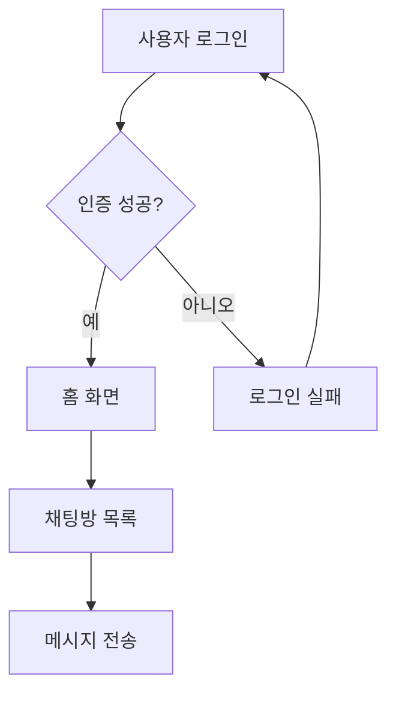

### 시퀀스 다이어그램

**Mermaid 버전:**
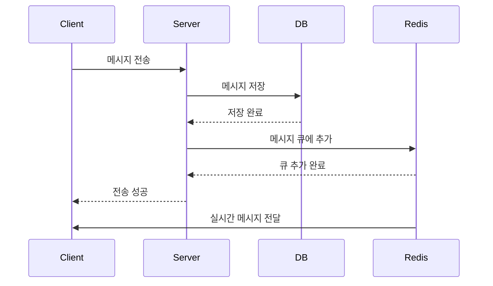

**PlantUML 버전 (더 표준적이고 깔끔함):**
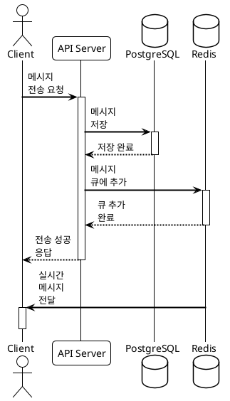

### 클래스 다이어그램

**Mermaid 버전:**
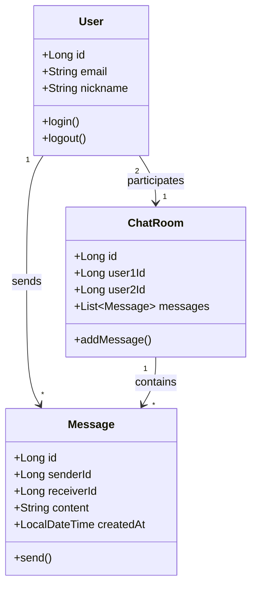

**PlantUML 버전 (UML 표준, 더 상세한 표현 가능):**
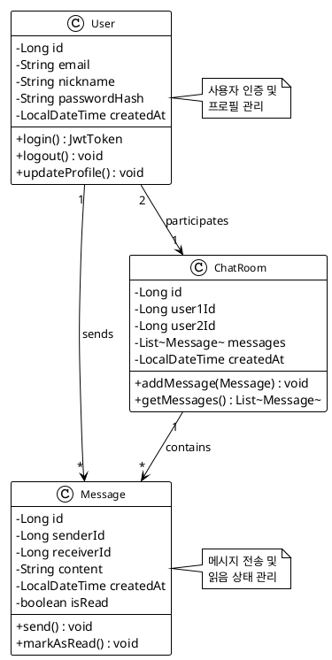

### ER 다이어그램

**Mermaid 버전:**
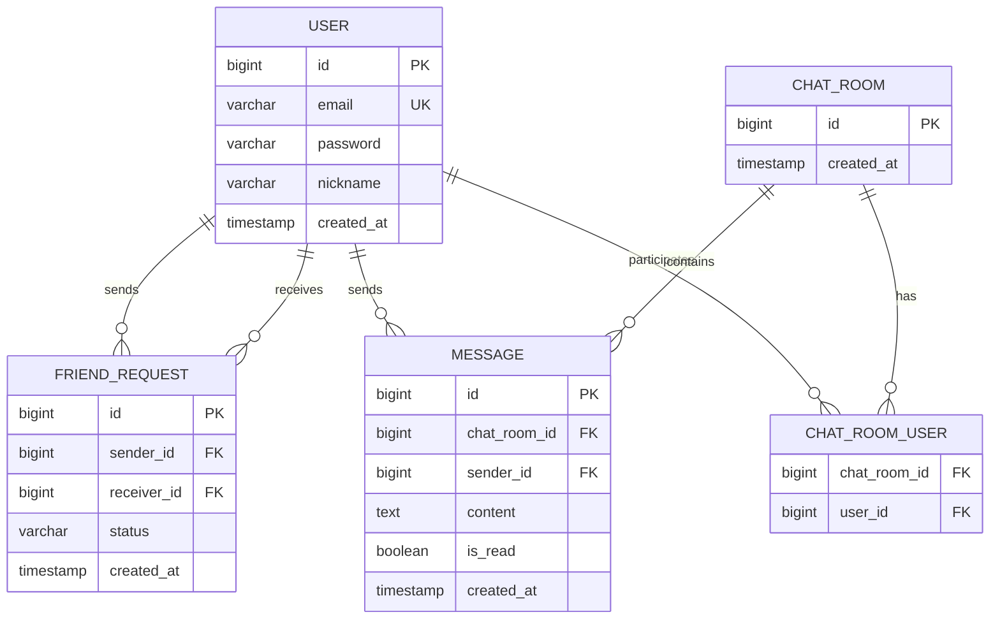

**PlantUML 버전 (더 표준적이고 상세한 표현):**
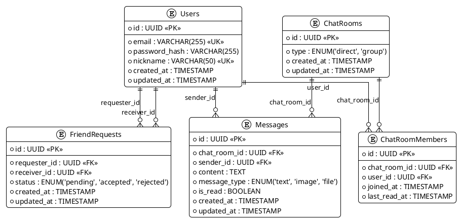

### 상태 다이어그램

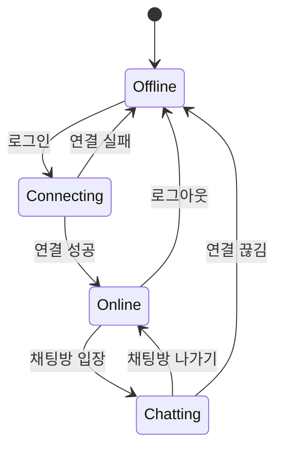

### 간트 차트

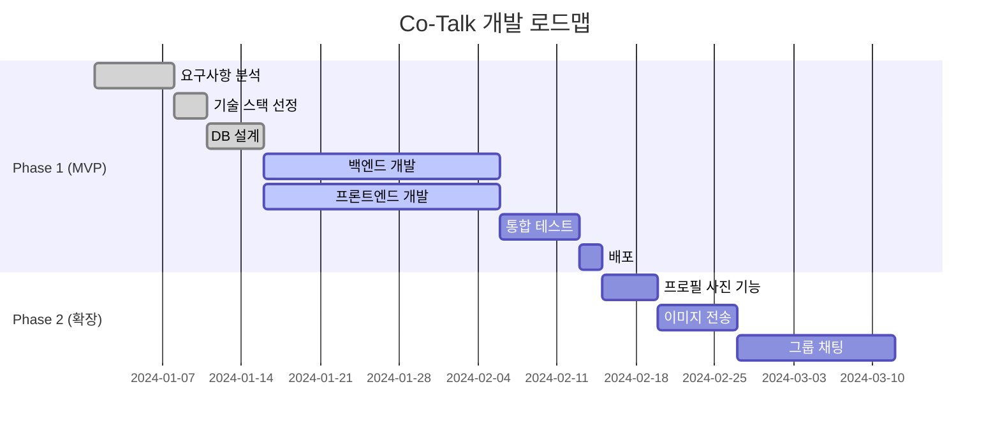

### Git 그래프

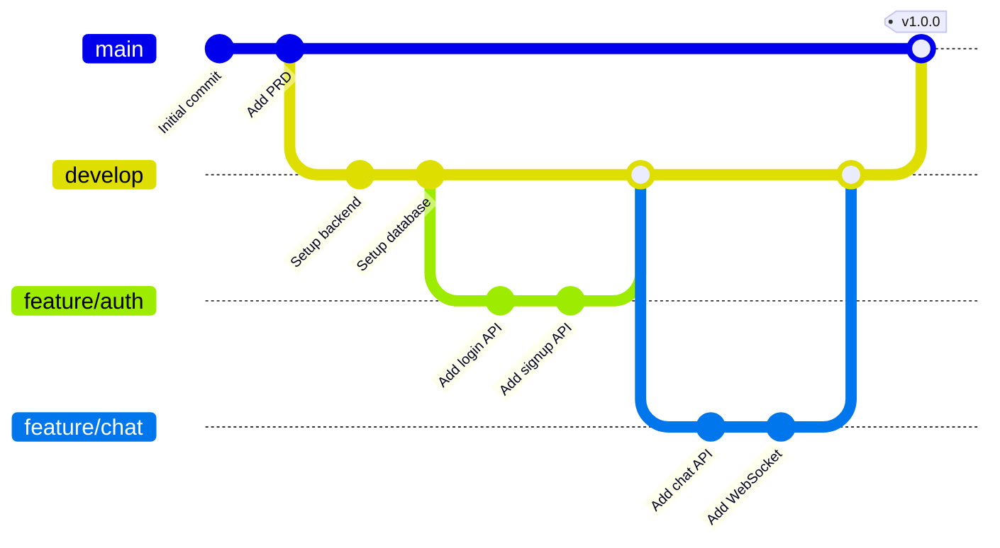

### 파이 차트

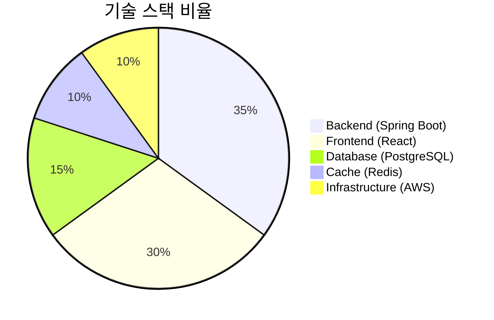

---

## 🎯 PlantUML 다이어그램

PlantUML은 UML 표준을 따르는 강력한 다이어그램 도구입니다. 특히 아키텍처 다이어그램과 ER 다이어그램에 유용합니다.

### 컴포넌트 다이어그램

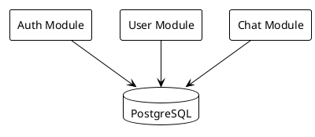

### 배포 다이어그램

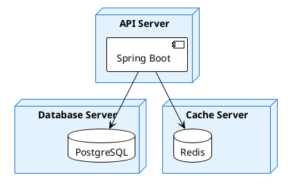

### ER 다이어그램

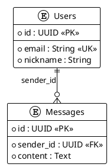

### 시퀀스 다이어그램

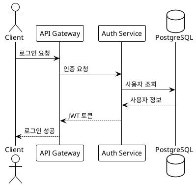

### 클래스 다이어그램

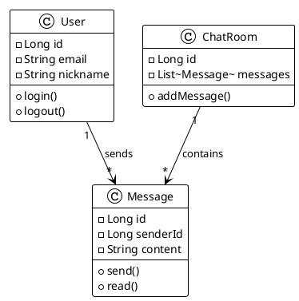

### 상태 다이어그램

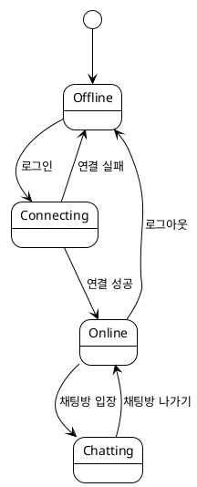

### 액티비티 다이어그램

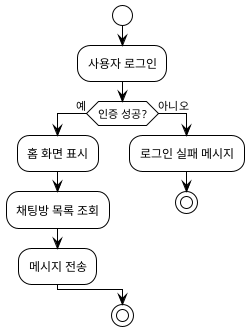

### 사용 팁

- **테마**: `!theme plain`, `!theme aws-orange`, `!theme reddress-darkblue` 등
- **스타일**: `skinparam` 명령으로 색상, 폰트 등 커스터마이징
- **다크모드**: 자동으로 다크 테마 적용됨

---

## 📐 수학 공식 (KaTeX)

### 인라인 수식

동시 접속자 수 처리를 위한 서버 용량 계산: $C = \frac{N \times M}{T}$

여기서:
- $C$: 초당 처리 용량
- $N$: 동시 접속자 수
- $M$: 평균 메시지 크기
- $T$: 응답 시간

### 블록 수식

**처리량(Throughput) 계산:**

$$
Throughput = \frac{Messages}{Second} = \frac{DAU \times AvgMessages}{86400}
$$

**캐시 적중률(Cache Hit Ratio):**

$$
HitRatio = \frac{CacheHits}{CacheHits + CacheMisses} \times 100\%
$$

**평균 응답 시간:**

$$
ResponseTime_{avg} = \sum_{i=1}^{n} \frac{ResponseTime_i \times Weight_i}{\sum_{j=1}^{n} Weight_j}
$$

**데이터베이스 용량 추정:**

$$
\begin{aligned}
Storage &= Users \times AvgMessages \times MessageSize \\
&= 10^6 \times 100 \times 1KB \\
&= 100GB
\end{aligned}
$$

**서버 확장 계산:**

$$
Servers_{required} = \lceil \frac{PeakLoad}{ServerCapacity} \rceil \times SafetyFactor
$$

---

## 🎯 사용 방법

### Mermaid 다이어그램 작성

마크다운 파일에서 다음과 같이 작성:

\`\`\`mermaid
graph LR
    A --> B
\`\`\`

### 수학 공식 작성

- **인라인**: `$E = mc^2$` → $E = mc^2$
- **블록**: 

```
$$
\sum_{i=1}^{n} i = \frac{n(n+1)}{2}
$$
```

---

## 💡 팁

### Mermaid
- [Mermaid 공식 문서](https://mermaid.js.org/)
- [Mermaid Live Editor](https://mermaid.live/) - 실시간 미리보기
- 다크모드 자동 지원

### KaTeX
- [KaTeX 지원 함수 목록](https://katex.org/docs/supported.html)
- LaTeX 문법 사용
- 빠른 렌더링

---

## 🚀 실전 예제

### 아키텍처 다이어그램

<div class="diagram-container" data-title="Co-Talk 시스템 아키텍처">

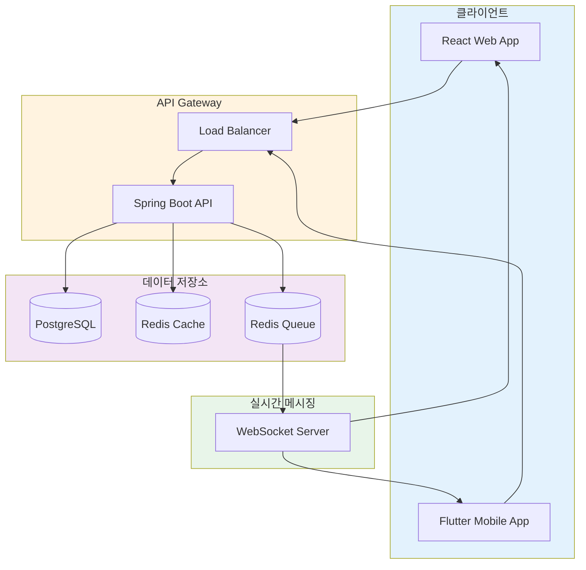

</div>

### 성능 지표

메시지 처리 지연시간 분포:

$$
P(X \leq x) = 1 - e^{-\lambda x}, \quad x \geq 0
$$

여기서 $\lambda = \frac{1}{mean\_latency}$

---

**이제 모든 문서에서 다이어그램과 수식을 자유롭게 사용할 수 있습니다!** ✨


