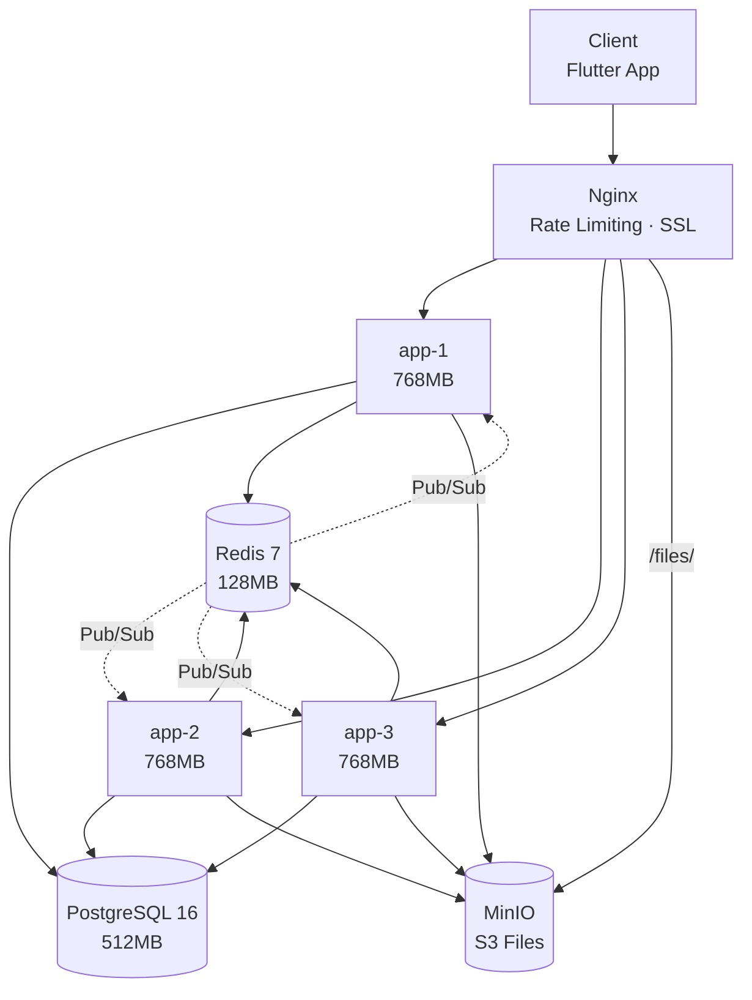
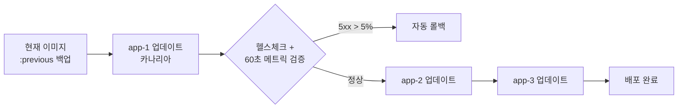

# 인프라 기술 스택

[← 기술 스택 개요](./index)

---

## 목차

- [현재 프로덕션 인프라](#현재-프로덕션-인프라)
- [스케일 아키텍처 (향후 계획)](#스케일-아키텍처-향후-계획)

---

## 현재 프로덕션 인프라

### 배포 환경

| 항목 | 설명 |
|------|------|
| **플랫폼** | Docker Compose on Synology NAS (8GB RAM) |
| **전략** | 카나리아 롤링 배포 (3개 인스턴스) |
| **리버스 프록시** | Nginx (round-robin + passive health check) |
| **Graceful Shutdown** | 30초 타임아웃 |
| **CI/CD** | GitHub Actions → GHCR → deploy.sh |

### 서비스 구성

| 서비스 | 이미지 | 메모리 제한 | 역할 |
|--------|-------|-------------|------|
| app-1, app-2, app-3 | GHCR co-talk | 768MB each | Spring Boot 3.5.6 |
| nginx | nginx:alpine | - | 리버스 프록시, Rate Limiting |
| postgres | postgres:16-alpine | 512MB | 주 데이터베이스 |
| redis | redis:7-alpine | 128MB | 캐시, Pub/Sub, Rate Limiting |
| minio | minio/minio | - | S3 호환 파일 스토리지 |
| prometheus | prom/prometheus | - | 메트릭 수집 (5초 스크래핑) |
| grafana | grafana/grafana:10.2.2 | - | 대시보드 |
| loki | grafana/loki:2.9.2 | - | 로그 집계 |
| promtail | grafana/promtail:2.9.2 | - | Docker 로그 수집 |
| zipkin | openzipkin/zipkin | - | 분산 추적 |
| alertmanager | prom/alertmanager | - | Slack/이메일 알림 |

**총 리소스 사용**: ~4.5GB / 8GB

### 아키텍처 다이어그램



### 카나리아 배포 흐름



### Nginx 설정

| 기능 | 설정 |
|------|------|
| **Rate Limiting** | auth 5r/m, WebSocket 10r/s, general 30r/s |
| **WebSocket** | `/ws` → Upgrade 헤더 처리 |
| **파일 프록시** | `/files/` → MinIO (외부 MinIO 포트 미노출) |
| **보안 헤더** | HSTS, CSP, X-Frame-Options, X-Content-Type-Options |
| **Load Balancing** | 3 upstream, passive health check |
| **K6 Bypass** | 부하 테스트용 특수 토큰 |

### 모니터링 스택

**Prometheus** (5초 스크래핑)
- 3개 인스턴스 Spring Boot Actuator `/actuator/prometheus`
- 커스텀 메트릭: messages sent/received, logins, WebSocket connections, Redis publish/delivery rates

**Grafana** (provisioned dashboards)
- 애플리케이션 성능, WebSocket, Redis, JVM 메트릭

**Loki + Promtail**
- Docker 컨테이너 로그 수집 (regex: `app-1|app-2|app-3`)
- Logstash Logback Encoder로 구조화된 JSON 로깅

**Zipkin**
- Micrometer Tracing (Brave bridge) 기반 분산 추적

**Alertmanager 알림 규칙**
| 규칙 | 심각도 |
|------|--------|
| InstanceDown | warning |
| MultipleInstancesDown | critical |
| 5xx 에러율 높음 | critical |
| 응답 시간 느림 | warning |
| CPU/메모리 초과 | warning |
| DB 커넥션 풀 소진 | critical |
| Redis publish 실패 | critical |
| WebSocket 전달 실패 | critical |
| 인스턴스 간 전달 불균형 | warning |

### 백업 전략

```bash
# 수동 백업
docker compose -f docker-compose.backup.yml run --rm backup

# 자동 백업 (cron)
docker compose -f docker-compose.backup.yml up -d backup-cron
```

---

## 스케일 아키텍처 (향후 계획)

> 아래는 사용자 수 증가에 따른 목표 인프라 아키텍처입니다.
> 현재 NAS 기반에서 클라우드 전환 시의 구성입니다.

### 컨테이너화

#### Docker + Kubernetes (AWS EKS)

| 장점 |
|------|
| 관리형 Kubernetes |
| 자동 스케일링 |
| 고가용성 |
| 통합 모니터링 |

### 로드 밸런서

#### AWS ALB + NLB

| 로드 밸런서 | 용도 |
|------------|------|
| **ALB** | HTTP/HTTPS 트래픽 (REST API) |
| **NLB** | TCP/UDP 트래픽 (WebSocket) |

### 목표 아키텍처

```
                    ┌─────────────┐
                    │   CDN       │
                    │ (CloudFlare)│
                    └──────┬──────┘
                           │
                    ┌──────▼────────────────────────────┐
                    │   Load Balancer (ALB/NLB)         │
                    │   - SSL Termination               │
                    │   - Health Check                   │
                    └──────┬────────────────────────────┘
                           │
        ┌──────────────────┼──────────────────┐
        │                  │                  │
┌───────▼──────┐  ┌────────▼────────┐  ┌─────▼──────┐
│ API Gateway  │  │  WebSocket     │  │  API       │
│ (Kong)       │  │  Servers       │  │  Servers   │
│              │  │  (Netty)       │  │  (Spring)  │
│              │  │  - 10 instances│  │  - 20 pods │
└───────┬──────┘  └────────┬────────┘  └─────┬──────┘
        │                  │                  │
        └──────────────────┼──────────────────┘
                           │
        ┌──────────────────┼──────────────────┐
        │                  │                  │
┌───────▼──────┐  ┌────────▼────────┐  ┌─────▼──────┐
│   Redis      │  │   Redis        │  │  Redis    │
│  Cluster     │  │  Cluster       │  │  Cluster  │
│  (Cache)     │  │  (Pub/Sub)     │  │  (Streams)│
└───────┬──────┘  └────────┬────────┘  └─────┬──────┘
        │                  │                  │
        └──────────────────┼──────────────────┘
                           │
        ┌──────────────────┼──────────────────┐
        │                  │                  │
┌───────▼──────┐  ┌────────▼────────┐  ┌─────▼──────┐
│ PostgreSQL   │  │  PostgreSQL     │  │ PostgreSQL │
│ (Primary)    │  │  (Read Replica) │  │ (Read      │
│              │  │                 │  │  Replica)  │
└──────────────┘  └─────────────────┘  └────────────┘
```

### 성능 최적화

**데이터베이스**
- Messages 테이블: 월별 파티셔닝
- Connection Pooling: HikariCP (최대 50 connections/instance)
- Read Replica: 읽기 쿼리 라우팅

**캐싱 (L1/L2)**
| 계층 | 기술 | TTL | 용도 |
|------|------|-----|------|
| L1 (Local) | Caffeine | 1분 | 자주 조회되는 데이터 |
| L2 (Redis) | Redis Cluster | 1시간 | 사용자 정보, 친구 목록 |

### 수평 확장 계획

| 컴포넌트 | 현재 (NAS) | 목표 (Cloud) | 최종 |
|----------|-----------|-------------|------|
| App 인스턴스 | 3대 (768MB) | 20 pods | Auto Scaling |
| WebSocket 서버 | 통합 | 10대 (분리) | 50대 |
| DB Read Replica | 없음 | 3개 | 5개 + 샤딩 |

### 월간 비용 예상 (AWS)

| 항목 | 비용 |
|------|------|
| EKS 클러스터 | $73 |
| EC2 (WebSocket, 10대) | $1,200 |
| EC2 (API, 20 pods) | $800 |
| RDS PostgreSQL | $500 |
| ElastiCache Redis | $600 |
| ALB/NLB | $50 |
| 데이터 전송 | $200 |
| **총계** | **~$3,400/월** |

| 최적화 방법 | 예상 비용 |
|------------|----------|
| Reserved Instances (30% 할인) | $2,400/월 |
| Spot Instances (70% 할인) | $1,700/월 |

---

## 관련 문서

→ [MSA vs 모놀리식 아키텍처 결정](../decisions/msa-vs-monolith)
→ [프로덕션 준비 가이드](../docs/PRODUCTION_READINESS.md)
